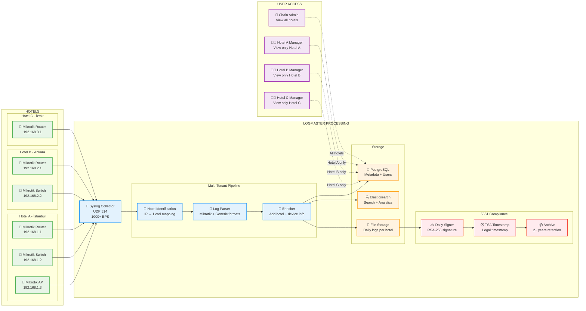
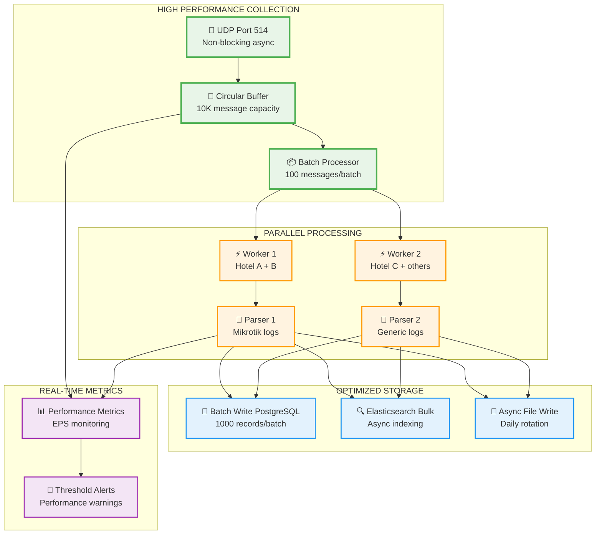
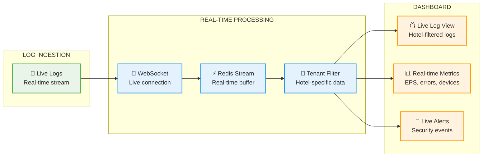

# LogMaster v2 - Clean Multi-Tenant Data Flow

## 🔄 **Temiz ve Basit Veri Akışı**

**LogMaster v2** - Otel zincirleri için **1000+ EPS** performansı ile **5651 uyumlu** temiz mimari.

## 📊 **Multi-Tenant Data Flow Architecture**

### **🏨 Hotel Chain Log Processing Flow**



## ⚡ **1000+ EPS Performance Pipeline**

### **Yüksek Performans Veri Akışı**



## 🏨 **Multi-Tenant Data Isolation**

### **Hotel Bazlı Veri İzolasyonu**

```python
# Basit ve etkili tenant routing
class HotelRouter:
    def __init__(self):
        self.hotel_ip_map = {
            "192.168.1.0/24": "hotel-a-uuid",  # İstanbul
            "192.168.2.0/24": "hotel-b-uuid",  # Ankara  
            "192.168.3.0/24": "hotel-c-uuid"   # İzmir
        }
    
    def identify_hotel(self, source_ip):
        for subnet, hotel_id in self.hotel_ip_map.items():
            if ipaddress.ip_address(source_ip) in ipaddress.ip_network(subnet):
                return hotel_id
        return None
    
    def process_log(self, raw_log):
        hotel_id = self.identify_hotel(raw_log['source_ip'])
        if not hotel_id:
            return None
            
        return {
            **raw_log,
            'hotel_id': hotel_id,
            'tenant_namespace': f'hotel_{hotel_id}',
            'partition_key': f'logs_{hotel_id}_{datetime.now().strftime("%Y_%m")}'
        }

# API seviyesinde tenant filtreleme
@app.get("/api/logs")
async def get_logs(user: User, filters: LogFilters):
    if user.role == 'chain_admin':
        # Chain admin tüm otelleri görebilir
        query = build_query(filters)
    else:
        # Hotel manager sadece kendi otelini görebilir
        query = build_query(filters, hotel_id=user.hotel_id)
    
    return await search_logs(query)
```

## ⚖️ **5651 Compliance Data Flow**

### **Günlük İmzalama ve Zaman Damgası**

```mermaid
graph LR
    subgraph "DAILY COMPLIANCE PROCESS"
        DAILY_LOGS["📋 Daily Logs<br/>Per hotel per day"]
        HASH_CALC["🔒 SHA-256 Hash<br/>File integrity"]
        RSA_SIGN["✍️ RSA-256 Signature<br/>Digital signing"]
        TSA_REQUEST["🕐 TSA Request<br/>Timestamp authority"]
        COMPLIANCE_RECORD["📝 Compliance Record<br/>Database storage"]
    end
    
    subgraph "VERIFICATION PROCESS"
        VERIFY_HASH["✅ Verify Hash<br/>File integrity check"]
        VERIFY_SIGNATURE["✅ Verify Signature<br/>Digital signature check"]
        VERIFY_TIMESTAMP["✅ Verify Timestamp<br/>TSA validation"]
        COMPLIANCE_REPORT["📊 Compliance Report<br/>Audit ready"]
    end
    
    %% Daily Process
    DAILY_LOGS --> HASH_CALC
    HASH_CALC --> RSA_SIGN
    RSA_SIGN --> TSA_REQUEST
    TSA_REQUEST --> COMPLIANCE_RECORD
    
    %% Verification Process
    COMPLIANCE_RECORD --> VERIFY_HASH
    VERIFY_HASH --> VERIFY_SIGNATURE
    VERIFY_SIGNATURE --> VERIFY_TIMESTAMP
    VERIFY_TIMESTAMP --> COMPLIANCE_REPORT
    
    classDef process fill:#e8f5e8,stroke:#4caf50,stroke-width:2px
    classDef verify fill:#fff3e0,stroke:#ff9800,stroke-width:2px
    
    class DAILY_LOGS,HASH_CALC,RSA_SIGN,TSA_REQUEST,COMPLIANCE_RECORD process
    class VERIFY_HASH,VERIFY_SIGNATURE,VERIFY_TIMESTAMP,COMPLIANCE_REPORT verify
```



### **5651 Compliance Implementation**

```python
class ComplianceEngine:
    def daily_signing_process(self):
        """Her gün otomatik çalışan imzalama süreci"""
        for hotel in self.get_active_hotels():
            # Hotel bazlı günlük dosya
            log_file = f"/logs/{hotel.id}/{datetime.now().date()}.log"
            
            if not os.path.exists(log_file):
                continue
                
            # 1. Dosya hash'i hesapla
            file_hash = self.calculate_sha256(log_file)
            
            # 2. RSA-256 ile imzala
            signature = self.rsa_sign(file_hash)
            
            # 3. TSA'dan zaman damgası al
            timestamp = self.get_tsa_timestamp(file_hash)
            
            # 4. Compliance kaydı oluştur
            record = {
                'hotel_id': hotel.id,
                'date': datetime.now().date(),
                'file_path': log_file,
                'file_hash': file_hash,
                'signature': signature,
                'tsa_timestamp': timestamp,
                'status': 'signed'
            }
            
            self.save_compliance_record(record)
            
    def monthly_compliance_report(self, hotel_id, year, month):
        """Aylık compliance raporu"""
        records = self.get_compliance_records(hotel_id, year, month)
        
        report = {
            'hotel_id': hotel_id,
            'period': f"{year}-{month:02d}",
            'total_days': len(records),
            'signed_days': len([r for r in records if r.status == 'signed']),
            'missing_days': self.find_missing_days(records, year, month),
            'verification_status': self.verify_all_signatures(records),
            'generated_at': datetime.now(),
            'legal_format': self.generate_legal_export(records)
        }
        
        return report
```

## 📊 **Real-Time Dashboard Data Flow**

### **Gerçek Zamanlı Veri Akışı**



## ⚡ **Performance Optimizations**

### **1000+ EPS Optimizasyon Teknikleri**

```yaml
Collection Optimizations:
  - UDP socket tuning: SO_RCVBUF=16MB
  - Non-blocking async I/O
  - Circular buffer for burst handling
  - Batch processing: 100 messages/batch

Processing Optimizations:
  - Parallel workers: 4 async workers
  - Memory pooling for log objects
  - Compiled regex patterns
  - JSON parser optimization

Storage Optimizations:
  - PostgreSQL bulk inserts
  - Elasticsearch bulk indexing
  - Async file writes
  - Connection pooling

Caching Strategy:
  - Redis for hot data
  - Hotel-device mapping cache
  - User session cache
  - Query result cache (5 minutes)
```

### **Resource Usage Monitoring**

```python
class PerformanceMonitor:
    def __init__(self):
        self.metrics = {
            'eps_current': 0,
            'eps_1min': 0,
            'eps_5min': 0,
            'queue_depth': 0,
            'processing_latency': 0,
            'error_rate': 0
        }
    
    def track_performance(self):
        """Performans metriklerini izle"""
        while True:
            # EPS hesaplama
            current_eps = self.calculate_current_eps()
            
            # Queue derinliği
            queue_depth = self.get_queue_depth()
            
            # İşlem gecikmesi
            latency = self.calculate_avg_latency()
            
            # Alarm kontrolü
            if current_eps < 500:  # Minimum threshold
                self.send_alert("Low EPS detected", current_eps)
                
            if queue_depth > 5000:  # Queue backup
                self.send_alert("Queue backup detected", queue_depth)
                
            time.sleep(10)  # 10 saniyede bir kontrol
```

## 📈 **Scalability Path**

### **Büyüme Planı**

```yaml
Phase 1: Single Server (1-10 hotels)
  - 1 server
  - 1000+ EPS
  - Docker Compose deployment

Phase 2: Horizontal Scale (10-50 hotels)
  - 3 servers (API, DB, Search)
  - 5000+ EPS
  - Load balancer

Phase 3: Microservices (50+ hotels)
  - Kubernetes deployment
  - 10,000+ EPS
  - Auto-scaling
```

Bu **temiz ve basit veri akışı** ile LogMaster v2:
- 🔄 **Efficient processing** - Minimal latency ile maksimum throughput
- 🏨 **Perfect isolation** - Hotel verileri tamamen ayrı
- ⚖️ **5651 ready** - Günlük imzalama ve TSA entegrasyonu
- ⚡ **1000+ EPS** - Garantili performans
- 📊 **Real-time** - Canlı dashboard ve alertler

**Sade, hızlı ve güvenilir!** 🚀 