# LogMaster v2 - Clean Multi-Tenant Data Flow

## 🔄 **Temiz ve Basit Veri Akışı**

**LogMaster v2** - Otel zincirleri için **1000+ EPS** performansı ile **5651 uyumlu** temiz mimari.

## 📊 **Multi-Tenant Data Flow Architecture**

### **🏨 Hotel Chain Log Processing Flow**

```mermaid
graph LR
    subgraph "HOTELS"
        subgraph "Hotel A - İstanbul"
            A_ROUTER["📡 Mikrotik Router<br/>192.168.1.1"]
            A_SWITCH["📡 Mikrotik Switch<br/>192.168.1.2"]
            A_AP["📡 Mikrotik AP<br/>192.168.1.3"]
        end
        
        subgraph "Hotel B - Ankara"
            B_ROUTER["📡 Mikrotik Router<br/>192.168.2.1"]
            B_SWITCH["📡 Mikrotik Switch<br/>192.168.2.2"]
        end
        
        subgraph "Hotel C - İzmir"
            C_ROUTER["📡 Mikrotik Router<br/>192.168.3.1"]
        end
    end
    
    subgraph "LOGMASTER PROCESSING"
        COLLECTOR["📡 Syslog Collector<br/>UDP 514<br/>1000+ EPS"]
        
        subgraph "Multi-Tenant Pipeline"
            HOTEL_ID["🏨 Hotel Identification<br/>IP → Hotel mapping"]
            PARSER["🔄 Log Parser<br/>Mikrotik + Generic formats"]
            ENRICHER["🎯 Enricher<br/>Add hotel + device info"]
        end
        
        subgraph "Storage"
            PG["🐘 PostgreSQL<br/>Metadata + Users"]
            ES["🔍 Elasticsearch<br/>Search + Analytics"]
            FILES["📁 File Storage<br/>Daily logs per hotel"]
        end
        
        subgraph "5651 Compliance"
            SIGNER["✍️ Daily Signer<br/>RSA-256 signature"]
            TSA["🕐 TSA Timestamp<br/>Legal timestamp"]
            ARCHIVE["📦 Archive<br/>2+ years retention"]
        end
    end
    
    subgraph "USER ACCESS"
        CHAIN_ADMIN["🏢 Chain Admin<br/>View all hotels"]
        HOTEL_MGR_A["👨‍💼 Hotel A Manager<br/>View only Hotel A"]
        HOTEL_MGR_B["👨‍💼 Hotel B Manager<br/>View only Hotel B"]
        HOTEL_MGR_C["👨‍💼 Hotel C Manager<br/>View only Hotel C"]
    end
    
    %% Device to Collector
    A_ROUTER --> COLLECTOR
    A_SWITCH --> COLLECTOR
    A_AP --> COLLECTOR
    B_ROUTER --> COLLECTOR
    B_SWITCH --> COLLECTOR
    C_ROUTER --> COLLECTOR
    
    %% Processing Pipeline
    COLLECTOR --> HOTEL_ID
    HOTEL_ID --> PARSER
    PARSER --> ENRICHER
    
    %% Storage Distribution
    ENRICHER --> PG
    ENRICHER --> ES
    ENRICHER --> FILES
    
    %% Compliance Process
    FILES --> SIGNER
    SIGNER --> TSA
    TSA --> ARCHIVE
    
    %% User Access (Tenant Isolated)
    CHAIN_ADMIN -.->|"All hotels"| PG
    HOTEL_MGR_A -.->|"Hotel A only"| PG
    HOTEL_MGR_B -.->|"Hotel B only"| PG
    HOTEL_MGR_C -.->|"Hotel C only"| PG
    
    classDef device fill:#e8f5e8,stroke:#4caf50,stroke-width:2px
    classDef processing fill:#e3f2fd,stroke:#2196f3,stroke-width:2px
    classDef storage fill:#fff3e0,stroke:#ff9800,stroke-width:2px
    classDef compliance fill:#ffebee,stroke:#f44336,stroke-width:2px
    classDef user fill:#f3e5f5,stroke:#9c27b0,stroke-width:2px
    
    class A_ROUTER,A_SWITCH,A_AP,B_ROUTER,B_SWITCH,C_ROUTER device
    class COLLECTOR,HOTEL_ID,PARSER,ENRICHER processing
    class PG,ES,FILES storage
    class SIGNER,TSA,ARCHIVE compliance
    class CHAIN_ADMIN,HOTEL_MGR_A,HOTEL_MGR_B,HOTEL_MGR_C user
```



## ⚡ **1000+ EPS Performance Pipeline**

### **Yüksek Performans Veri Akışı**

```mermaid
graph TB
    subgraph "HIGH PERFORMANCE COLLECTION"
        UDP_514["📡 UDP Port 514<br/>Non-blocking async"]
        BUFFER["🔄 Circular Buffer<br/>10K message capacity"]
        BATCH["📦 Batch Processor<br/>100 messages/batch"]
    end
    
    subgraph "PARALLEL PROCESSING"
        WORKER_1["⚡ Worker 1<br/>Hotel A + B"]
        WORKER_2["⚡ Worker 2<br/>Hotel C + others"]
        PARSER_1["🔄 Parser 1<br/>Mikrotik logs"]
        PARSER_2["🔄 Parser 2<br/>Generic logs"]
    end
    
    subgraph "OPTIMIZED STORAGE"
        PG_WRITE["🐘 Batch Write PostgreSQL<br/>1000 records/batch"]
        ES_BULK["🔍 Elasticsearch Bulk<br/>Async indexing"]
        FILE_WRITE["📁 Async File Write<br/>Daily rotation"]
    end
    
    subgraph "REAL-TIME METRICS"
        METRICS["📊 Performance Metrics<br/>EPS monitoring"]
        ALERTS["🚨 Threshold Alerts<br/>Performance warnings"]
    end
    
    %% Performance Flow
    UDP_514 --> BUFFER
    BUFFER --> BATCH
    
    BATCH --> WORKER_1
    BATCH --> WORKER_2
    
    WORKER_1 --> PARSER_1
    WORKER_2 --> PARSER_2
    
    PARSER_1 --> PG_WRITE
    PARSER_1 --> ES_BULK
    PARSER_1 --> FILE_WRITE
    
    PARSER_2 --> PG_WRITE
    PARSER_2 --> ES_BULK
    PARSER_2 --> FILE_WRITE
    
    %% Monitoring
    BUFFER --> METRICS
    PARSER_1 --> METRICS
    METRICS --> ALERTS
    
    classDef performance fill:#e8f5e8,stroke:#4caf50,stroke-width:3px
    classDef worker fill:#fff3e0,stroke:#ff9800,stroke-width:2px
    classDef storage fill:#e3f2fd,stroke:#2196f3,stroke-width:2px
    classDef monitoring fill:#f3e5f5,stroke:#9c27b0,stroke-width:2px
    
    class UDP_514,BUFFER,BATCH performance
    class WORKER_1,WORKER_2,PARSER_1,PARSER_2 worker
    class PG_WRITE,ES_BULK,FILE_WRITE storage
    class METRICS,ALERTS monitoring
```



## 🏨 **Multi-Tenant Data Isolation**

### **Hotel Bazlı Veri İzolasyonu**

```python
# Basit ve etkili tenant routing
class HotelRouter:
    def __init__(self):
        self.hotel_ip_map = {
            "192.168.1.0/24": "hotel-a-uuid",  # İstanbul
            "192.168.2.0/24": "hotel-b-uuid",  # Ankara  
            "192.168.3.0/24": "hotel-c-uuid"   # İzmir
        }
    
    def identify_hotel(self, source_ip):
        for subnet, hotel_id in self.hotel_ip_map.items():
            if ipaddress.ip_address(source_ip) in ipaddress.ip_network(subnet):
                return hotel_id
        return None
    
    def process_log(self, raw_log):
        hotel_id = self.identify_hotel(raw_log['source_ip'])
        if not hotel_id:
            return None
            
        return {
            **raw_log,
            'hotel_id': hotel_id,
            'tenant_namespace': f'hotel_{hotel_id}',
            'partition_key': f'logs_{hotel_id}_{datetime.now().strftime("%Y_%m")}'
        }

# API seviyesinde tenant filtreleme
@app.get("/api/logs")
async def get_logs(user: User, filters: LogFilters):
    if user.role == 'chain_admin':
        # Chain admin tüm otelleri görebilir
        query = build_query(filters)
    else:
        # Hotel manager sadece kendi otelini görebilir
        query = build_query(filters, hotel_id=user.hotel_id)
    
    return await search_logs(query)
```

## ⚖️ **5651 Compliance Data Flow**

### **Günlük İmzalama ve Zaman Damgası**

```mermaid
graph LR
    subgraph "DAILY COMPLIANCE PROCESS"
        DAILY_LOGS["📋 Daily Logs<br/>Per hotel per day"]
        HASH_CALC["🔒 SHA-256 Hash<br/>File integrity"]
        RSA_SIGN["✍️ RSA-256 Signature<br/>Digital signing"]
        TSA_REQUEST["🕐 TSA Request<br/>Timestamp authority"]
        COMPLIANCE_RECORD["📝 Compliance Record<br/>Database storage"]
    end
    
    subgraph "VERIFICATION PROCESS"
        VERIFY_HASH["✅ Verify Hash<br/>File integrity check"]
        VERIFY_SIGNATURE["✅ Verify Signature<br/>Digital signature check"]
        VERIFY_TIMESTAMP["✅ Verify Timestamp<br/>TSA validation"]
        COMPLIANCE_REPORT["📊 Compliance Report<br/>Audit ready"]
    end
    
    %% Daily Process
    DAILY_LOGS --> HASH_CALC
    HASH_CALC --> RSA_SIGN
    RSA_SIGN --> TSA_REQUEST
    TSA_REQUEST --> COMPLIANCE_RECORD
    
    %% Verification Process
    COMPLIANCE_RECORD --> VERIFY_HASH
    VERIFY_HASH --> VERIFY_SIGNATURE
    VERIFY_SIGNATURE --> VERIFY_TIMESTAMP
    VERIFY_TIMESTAMP --> COMPLIANCE_REPORT
    
    classDef process fill:#e8f5e8,stroke:#4caf50,stroke-width:2px
    classDef verify fill:#fff3e0,stroke:#ff9800,stroke-width:2px
    
    class DAILY_LOGS,HASH_CALC,RSA_SIGN,TSA_REQUEST,COMPLIANCE_RECORD process
    class VERIFY_HASH,VERIFY_SIGNATURE,VERIFY_TIMESTAMP,COMPLIANCE_REPORT verify
```



### **5651 Compliance Implementation**

```python
class ComplianceEngine:
    def daily_signing_process(self):
        """Her gün otomatik çalışan imzalama süreci"""
        for hotel in self.get_active_hotels():
            # Hotel bazlı günlük dosya
            log_file = f"/logs/{hotel.id}/{datetime.now().date()}.log"
            
            if not os.path.exists(log_file):
                continue
                
            # 1. Dosya hash'i hesapla
            file_hash = self.calculate_sha256(log_file)
            
            # 2. RSA-256 ile imzala
            signature = self.rsa_sign(file_hash)
            
            # 3. TSA'dan zaman damgası al
            timestamp = self.get_tsa_timestamp(file_hash)
            
            # 4. Compliance kaydı oluştur
            record = {
                'hotel_id': hotel.id,
                'date': datetime.now().date(),
                'file_path': log_file,
                'file_hash': file_hash,
                'signature': signature,
                'tsa_timestamp': timestamp,
                'status': 'signed'
            }
            
            self.save_compliance_record(record)
            
    def monthly_compliance_report(self, hotel_id, year, month):
        """Aylık compliance raporu"""
        records = self.get_compliance_records(hotel_id, year, month)
        
        report = {
            'hotel_id': hotel_id,
            'period': f"{year}-{month:02d}",
            'total_days': len(records),
            'signed_days': len([r for r in records if r.status == 'signed']),
            'missing_days': self.find_missing_days(records, year, month),
            'verification_status': self.verify_all_signatures(records),
            'generated_at': datetime.now(),
            'legal_format': self.generate_legal_export(records)
        }
        
        return report
```

## 📊 **Real-Time Dashboard Data Flow**

### **Gerçek Zamanlı Veri Akışı**

```mermaid
graph LR
    subgraph "LOG INGESTION"
        LIVE_LOGS["📝 Live Logs<br/>Real-time stream"]
    end
    
    subgraph "REAL-TIME PROCESSING"
        WEBSOCKET["🔌 WebSocket<br/>Live connection"]
        REDIS_STREAM["⚡ Redis Stream<br/>Real-time buffer"]
        FILTER["🎯 Tenant Filter<br/>Hotel-specific data"]
    end
    
    subgraph "DASHBOARD"
        LIVE_VIEW["📺 Live Log View<br/>Hotel-filtered logs"]
        METRICS["📊 Real-time Metrics<br/>EPS, errors, devices"]
        ALERTS["🚨 Live Alerts<br/>Security events"]
    end
    
    %% Real-time Flow
    LIVE_LOGS --> WEBSOCKET
    WEBSOCKET --> REDIS_STREAM
    REDIS_STREAM --> FILTER
    FILTER --> LIVE_VIEW
    FILTER --> METRICS
    FILTER --> ALERTS
    
    classDef realtime fill:#e8f5e8,stroke:#4caf50,stroke-width:2px
    classDef processing fill:#e3f2fd,stroke:#2196f3,stroke-width:2px
    classDef dashboard fill:#fff3e0,stroke:#ff9800,stroke-width:2px
    
    class LIVE_LOGS realtime
    class WEBSOCKET,REDIS_STREAM,FILTER processing
    class LIVE_VIEW,METRICS,ALERTS dashboard
```



## ⚡ **Performance Optimizations**

### **1000+ EPS Optimizasyon Teknikleri**

```yaml
Collection Optimizations:
  - UDP socket tuning: SO_RCVBUF=16MB
  - Non-blocking async I/O
  - Circular buffer for burst handling
  - Batch processing: 100 messages/batch

Processing Optimizations:
  - Parallel workers: 4 async workers
  - Memory pooling for log objects
  - Compiled regex patterns
  - JSON parser optimization

Storage Optimizations:
  - PostgreSQL bulk inserts
  - Elasticsearch bulk indexing
  - Async file writes
  - Connection pooling

Caching Strategy:
  - Redis for hot data
  - Hotel-device mapping cache
  - User session cache
  - Query result cache (5 minutes)
```

### **Resource Usage Monitoring**

```python
class PerformanceMonitor:
    def __init__(self):
        self.metrics = {
            'eps_current': 0,
            'eps_1min': 0,
            'eps_5min': 0,
            'queue_depth': 0,
            'processing_latency': 0,
            'error_rate': 0
        }
    
    def track_performance(self):
        """Performans metriklerini izle"""
        while True:
            # EPS hesaplama
            current_eps = self.calculate_current_eps()
            
            # Queue derinliği
            queue_depth = self.get_queue_depth()
            
            # İşlem gecikmesi
            latency = self.calculate_avg_latency()
            
            # Alarm kontrolü
            if current_eps < 500:  # Minimum threshold
                self.send_alert("Low EPS detected", current_eps)
                
            if queue_depth > 5000:  # Queue backup
                self.send_alert("Queue backup detected", queue_depth)
                
            time.sleep(10)  # 10 saniyede bir kontrol
```

## 📈 **Scalability Path**

### **Büyüme Planı**

```yaml
Phase 1: Single Server (1-10 hotels)
  - 1 server
  - 1000+ EPS
  - Docker Compose deployment

Phase 2: Horizontal Scale (10-50 hotels)
  - 3 servers (API, DB, Search)
  - 5000+ EPS
  - Load balancer

Phase 3: Microservices (50+ hotels)
  - Kubernetes deployment
  - 10,000+ EPS
  - Auto-scaling
```

Bu **temiz ve basit veri akışı** ile LogMaster v2:
- 🔄 **Efficient processing** - Minimal latency ile maksimum throughput
- 🏨 **Perfect isolation** - Hotel verileri tamamen ayrı
- ⚖️ **5651 ready** - Günlük imzalama ve TSA entegrasyonu
- ⚡ **1000+ EPS** - Garantili performans
- 📊 **Real-time** - Canlı dashboard ve alertler

**Sade, hızlı ve güvenilir!** 🚀 

## ⚡ **1000+ EPS High-Performance Pipeline with Redis**

### **Redis-Powered High-Throughput Data Flow**

```mermaid
graph TB
    subgraph "HIGH-PERFORMANCE COLLECTION (1000+ EPS)"
        UDP_514["📡 UDP Port 514<br/>Async non-blocking"]
        LOAD_BALANCER["⚖️ Load Balancer<br/>Distribute to collectors"]
        COLLECTOR_1["📡 Collector 1<br/>500 EPS capacity"]
        COLLECTOR_2["📡 Collector 2<br/>500 EPS capacity"]
        REDIS_QUEUE["⚡ Redis Queue<br/>High-throughput buffer<br/>16GB memory"]
    end
    
    subgraph "PARALLEL PROCESSING WORKERS"
        WORKER_1["🔄 Worker 1<br/>Hotel A+B processing<br/>250 EPS"]
        WORKER_2["🔄 Worker 2<br/>Hotel C+D processing<br/>250 EPS"]
        WORKER_3["🔄 Worker 3<br/>Hotel E+F processing<br/>250 EPS"]
        WORKER_4["🔄 Worker 4<br/>Hotel G+H processing<br/>250 EPS"]
        BATCH_PROCESSOR["📦 Batch Processor<br/>100 events/batch"]
    end
    
    subgraph "REDIS-ENHANCED STORAGE"
        REDIS_CACHE["⚡ Redis Cache<br/>Hot data + Sessions<br/>8GB memory"]
        PG_BULK["🐘 PostgreSQL Bulk Insert<br/>1000 records/transaction"]
        ES_BULK["🔍 Elasticsearch Bulk Index<br/>Async indexing"]
        FILE_ASYNC["📁 Async File Writer<br/>Hotel-partitioned storage"]
    end
    
    subgraph "REAL-TIME SYSTEM"
        REDIS_PUBSUB["📡 Redis Pub/Sub<br/>Real-time hotel channels"]
        WEBSOCKET_MGR["🔌 WebSocket Manager<br/>Hotel-aware connections"]
        LIVE_DASHBOARD["📺 Live Dashboard<br/>Sub-second updates"]
    end
    
    %% High-Performance Flow
    UDP_514 --> LOAD_BALANCER
    LOAD_BALANCER --> COLLECTOR_1
    LOAD_BALANCER --> COLLECTOR_2
    
    COLLECTOR_1 --> REDIS_QUEUE
    COLLECTOR_2 --> REDIS_QUEUE
    
    REDIS_QUEUE --> WORKER_1
    REDIS_QUEUE --> WORKER_2
    REDIS_QUEUE --> WORKER_3
    REDIS_QUEUE --> WORKER_4
    
    WORKER_1 --> BATCH_PROCESSOR
    WORKER_2 --> BATCH_PROCESSOR
    WORKER_3 --> BATCH_PROCESSOR
    WORKER_4 --> BATCH_PROCESSOR
    
    BATCH_PROCESSOR --> PG_BULK
    BATCH_PROCESSOR --> ES_BULK
    BATCH_PROCESSOR --> FILE_ASYNC
    BATCH_PROCESSOR --> REDIS_CACHE
    
    %% Real-time Updates
    BATCH_PROCESSOR --> REDIS_PUBSUB
    REDIS_PUBSUB --> WEBSOCKET_MGR
    WEBSOCKET_MGR --> LIVE_DASHBOARD
    
    classDef performance fill:#e8f5e8,stroke:#4caf50,stroke-width:3px
    classDef redis fill:#ffebee,stroke:#f44336,stroke-width:3px
    classDef worker fill:#fff3e0,stroke:#ff9800,stroke-width:2px
    classDef storage fill:#e3f2fd,stroke:#2196f3,stroke-width:2px
    classDef realtime fill:#f3e5f5,stroke:#9c27b0,stroke-width:3px
    
    class UDP_514,LOAD_BALANCER,COLLECTOR_1,COLLECTOR_2 performance
    class REDIS_QUEUE,REDIS_CACHE,REDIS_PUBSUB redis
    class WORKER_1,WORKER_2,WORKER_3,WORKER_4,BATCH_PROCESSOR worker
    class PG_BULK,ES_BULK,FILE_ASYNC storage
    class WEBSOCKET_MGR,LIVE_DASHBOARD realtime
```



### **Redis Queue Management Implementation**

```python
# High-performance Redis queue management
class HighPerformanceLogQueue:
    def __init__(self):
        self.redis_queue = redis.Redis(host='redis-queue', port=6379, db=0)
        self.redis_cache = redis.Redis(host='redis-cache', port=6379, db=0)
        self.batch_size = 100
        self.max_queue_size = 10000
        
    async def enqueue_log(self, log_data):
        """High-speed log enqueueing"""
        queue_size = await self.redis_queue.llen("log_queue")
        
        if queue_size > self.max_queue_size:
            # Alert: Queue backup detected
            await self.send_alert("Queue backup", queue_size)
            return False
            
        # Push to Redis queue (O(1) operation)
        await self.redis_queue.lpush("log_queue", json.dumps(log_data))
        
        # Update real-time metrics
        await self.redis_cache.incr("logs_received_count")
        return True
    
    async def dequeue_batch(self, worker_id):
        """Batch dequeue for parallel processing"""
        # Atomic batch fetch and remove
        pipe = self.redis_queue.pipeline()
        pipe.lrange("log_queue", 0, self.batch_size - 1)
        pipe.ltrim("log_queue", self.batch_size, -1)
        results = await pipe.execute()
        
        batch_data = results[0]
        if batch_data:
            # Parse JSON batch
            return [json.loads(log) for log in batch_data]
        return []

# Parallel worker implementation
class HighPerformanceWorker:
    def __init__(self, worker_id, hotel_assignments):
        self.worker_id = worker_id
        self.hotel_assignments = hotel_assignments  # ['hotel-a', 'hotel-b']
        self.queue_manager = HighPerformanceLogQueue()
        self.processing_rate = 250  # EPS per worker
        
    async def process_logs(self):
        """Main worker processing loop"""
        while True:
            start_time = time.time()
            
            # Get batch from Redis queue
            log_batch = await self.queue_manager.dequeue_batch(self.worker_id)
            
            if not log_batch:
                await asyncio.sleep(0.1)  # Brief sleep if no logs
                continue
                
            # Filter logs for assigned hotels
            assigned_logs = [
                log for log in log_batch 
                if self.identify_hotel(log) in self.hotel_assignments
            ]
            
            if assigned_logs:
                # Process batch
                processed_batch = await self.process_batch_parallel(assigned_logs)
                
                # Send to storage
                await self.send_to_storage(processed_batch)
                
                # Real-time notifications
                await self.send_real_time_updates(processed_batch)
                
            # Performance tracking
            processing_time = time.time() - start_time
            await self.update_worker_metrics(len(log_batch), processing_time)
    
    async def process_batch_parallel(self, log_batch):
        """Parallel processing within worker"""
        tasks = []
        for log in log_batch:
            task = asyncio.create_task(self.process_single_log(log))
            tasks.append(task)
            
        # Process all logs in parallel
        results = await asyncio.gather(*tasks, return_exceptions=True)
        
        # Filter out exceptions
        return [result for result in results if not isinstance(result, Exception)]
```

### **Hotel-Aware Real-Time Updates**

```python
# Redis Pub/Sub for real-time hotel updates
class RealTimeHotelUpdates:
    def __init__(self):
        self.redis_pubsub = redis.Redis(host='redis-cache', port=6379, db=1)
        self.active_connections = {}  # hotel_id -> [websocket_connections]
        
    async def publish_to_hotel(self, hotel_id, log_data):
        """Publish log to specific hotel channel"""
        channel = f"hotel_{hotel_id}_logs"
        
        # Real-time log data
        real_time_data = {
            'type': 'new_log',
            'timestamp': datetime.now().isoformat(),
            'hotel_id': hotel_id,
            'log': log_data,
            'device_name': log_data.get('device_name'),
            'severity': log_data.get('log_level')
        }
        
        # Publish to Redis channel
        await self.redis_pubsub.publish(channel, json.dumps(real_time_data))
        
        # Update live statistics
        await self.update_hotel_stats(hotel_id)
    
    async def subscribe_hotel_channel(self, hotel_id, websocket):
        """Subscribe WebSocket to hotel-specific updates"""
        channel = f"hotel_{hotel_id}_logs"
        
        # Add connection to tracking
        if hotel_id not in self.active_connections:
            self.active_connections[hotel_id] = []
        self.active_connections[hotel_id].append(websocket)
        
        # Subscribe to Redis channel
        pubsub = self.redis_pubsub.pubsub()
        await pubsub.subscribe(channel)
        
        try:
            async for message in pubsub.listen():
                if message['type'] == 'message':
                    # Send to WebSocket client
                    await websocket.send_text(message['data'])
        except WebSocketDisconnect:
            # Remove connection on disconnect
            self.active_connections[hotel_id].remove(websocket)
        finally:
            await pubsub.unsubscribe(channel)
    
    async def update_hotel_stats(self, hotel_id):
        """Update real-time hotel statistics"""
        stats_key = f"hotel_{hotel_id}_stats"
        
        # Increment counters
        pipe = self.redis_pubsub.pipeline()
        pipe.hincrby(stats_key, "logs_today", 1)
        pipe.hincrby(stats_key, "logs_this_hour", 1)
        pipe.hset(stats_key, "last_log_time", datetime.now().isoformat())
        
        # Set expiration for hour counter
        pipe.expire(f"hotel_{hotel_id}_logs_hour", 3600)
        
        await pipe.execute()
```

## 🏨 **Multi-Tenant Data Isolation with Redis**

### **Hotel-Specific Caching Strategy**

```python
# Hotel-aware caching with Redis
class HotelCacheManager:
    def __init__(self):
        self.redis_cache = redis.Redis(host='redis-cache', port=6379, db=0)
        self.cache_ttl = 300  # 5 minutes default TTL
        
    async def get_hotel_devices(self, hotel_id):
        """Get hotel devices with caching"""
        cache_key = f"hotel_{hotel_id}_devices"
        
        # Try cache first
        cached_devices = await self.redis_cache.get(cache_key)
        if cached_devices:
            return json.loads(cached_devices)
            
        # Cache miss - fetch from database
        devices = await self.fetch_devices_from_db(hotel_id)
        
        # Cache for future requests
        await self.redis_cache.setex(
            cache_key, 
            self.cache_ttl, 
            json.dumps(devices)
        )
        
        return devices
    
    async def get_hotel_users(self, hotel_id):
        """Get hotel users with caching"""
        cache_key = f"hotel_{hotel_id}_users"
        
        cached_users = await self.redis_cache.get(cache_key)
        if cached_users:
            return json.loads(cached_users)
            
        users = await self.fetch_users_from_db(hotel_id)
        await self.redis_cache.setex(cache_key, self.cache_ttl, json.dumps(users))
        
        return users
    
    async def invalidate_hotel_cache(self, hotel_id):
        """Invalidate all cache for a hotel"""
        pattern = f"hotel_{hotel_id}_*"
        
        # Find all matching keys
        keys = await self.redis_cache.keys(pattern)
        
        if keys:
            # Delete all matching keys
            await self.redis_cache.delete(*keys)
    
    async def get_hotel_log_stats(self, hotel_id, time_period='1h'):
        """Get real-time log statistics"""
        stats_key = f"hotel_{hotel_id}_stats_{time_period}"
        
        stats = await self.redis_cache.hgetall(stats_key)
        if not stats:
            # Calculate stats from database if not cached
            stats = await self.calculate_hotel_stats(hotel_id, time_period)
            
            # Cache for short period
            await self.redis_cache.hmset(stats_key, stats)
            await self.redis_cache.expire(stats_key, 60)  # 1 minute TTL
            
        return stats

# Hotel-aware session management
class HotelSessionManager:
    def __init__(self):
        self.redis_cache = redis.Redis(host='redis-cache', port=6379, db=2)
        self.session_ttl = 3600  # 1 hour
        
    async def create_hotel_session(self, user_id, hotel_id, permissions):
        """Create session with hotel context"""
        session_token = secrets.token_urlsafe(32)
        
        session_data = {
            'user_id': user_id,
            'hotel_id': hotel_id,
            'permissions': permissions,
            'created_at': datetime.now().isoformat(),
            'last_activity': datetime.now().isoformat()
        }
        
        # Store session in Redis
        session_key = f"session_{session_token}"
        await self.redis_cache.setex(
            session_key,
            self.session_ttl,
            json.dumps(session_data)
        )
        
        # Track active sessions per hotel
        hotel_sessions_key = f"hotel_{hotel_id}_sessions"
        await self.redis_cache.sadd(hotel_sessions_key, session_token)
        
        return session_token
    
    async def validate_hotel_access(self, session_token, requested_hotel_id):
        """Validate user can access requested hotel"""
        session_key = f"session_{session_token}"
        session_data = await self.redis_cache.get(session_key)
        
        if not session_data:
            return False, None
            
        session = json.loads(session_data)
        user_hotel_id = session['hotel_id']
        
        # Chain admin can access all hotels
        if 'chain_admin' in session.get('permissions', []):
            return True, session
            
        # Hotel users can only access own hotel
        if user_hotel_id == requested_hotel_id:
            # Update last activity
            session['last_activity'] = datetime.now().isoformat()
            await self.redis_cache.setex(
                session_key,
                self.session_ttl,
                json.dumps(session)
            )
            return True, session
            
        return False, None
```

## 📊 **Performance Monitoring with Redis**

### **Real-Time Metrics Collection**

```python
# Redis-based performance monitoring
class PerformanceMonitor:
    def __init__(self):
        self.redis_metrics = redis.Redis(host='redis-cache', port=6379, db=3)
        
    async def track_events_per_second(self):
        """Track EPS with sliding window"""
        current_minute = int(time.time() // 60)
        current_second = int(time.time())
        
        # Increment counters
        pipe = self.redis_metrics.pipeline()
        pipe.incr(f"eps_minute_{current_minute}")
        pipe.incr(f"eps_second_{current_second}")
        
        # Set expiration
        pipe.expire(f"eps_minute_{current_minute}", 3600)
        pipe.expire(f"eps_second_{current_second}", 60)
        
        await pipe.execute()
    
    async def get_current_eps(self):
        """Get current events per second"""
        current_minute = int(time.time() // 60)
        
        # Get last 60 seconds
        eps_data = []
        for i in range(60):
            second = current_minute * 60 + i
            count = await self.redis_metrics.get(f"eps_second_{second}")
            eps_data.append(int(count) if count else 0)
        
        # Calculate average EPS
        return sum(eps_data) / len(eps_data)
    
    async def track_queue_metrics(self):
        """Track Redis queue performance"""
        queue_size = await self.redis_queue.llen("log_queue")
        
        # Store queue metrics
        metrics = {
            'queue_depth': queue_size,
            'timestamp': datetime.now().isoformat(),
            'alert_threshold': 10000
        }
        
        await self.redis_metrics.zadd(
            "queue_metrics",
            {json.dumps(metrics): time.time()}
        )
        
        # Keep only last hour of metrics
        cutoff_time = time.time() - 3600
        await self.redis_metrics.zremrangebyscore("queue_metrics", 0, cutoff_time)
        
        # Alert if queue is backing up
        if queue_size > 10000:
            await self.send_alert("Queue backup detected", queue_size)
    
    async def get_hotel_performance_stats(self, hotel_id):
        """Get hotel-specific performance stats"""
        stats_key = f"hotel_{hotel_id}_performance"
        
        # Get cached stats
        cached_stats = await self.redis_metrics.hgetall(stats_key)
        
        if not cached_stats:
            # Calculate fresh stats
            stats = await self.calculate_hotel_performance(hotel_id)
            
            # Cache for 5 minutes
            await self.redis_metrics.hmset(stats_key, stats)
            await self.redis_metrics.expire(stats_key, 300)
            
            return stats
            
        return cached_stats

# Performance alerting system
async def performance_monitoring_loop():
    """Main performance monitoring loop"""
    monitor = PerformanceMonitor()
    
    while True:
        try:
            # Track EPS
            await monitor.track_events_per_second()
            current_eps = await monitor.get_current_eps()
            
            # Track queue
            await monitor.track_queue_metrics()
            
            # Alert if performance drops
            if current_eps < 800:  # Below target
                await monitor.send_alert("Low EPS detected", current_eps)
                
            # Sleep for 1 second
            await asyncio.sleep(1)
            
        except Exception as e:
            logger.error(f"Performance monitoring error: {e}")
            await asyncio.sleep(5)
```

Bu **Redis-powered 1000+ EPS** veri akışı ile LogMaster v2:
- ⚡ **High-throughput processing** - Redis queue ile paralel işlem
- 🔄 **Parallel workers** - 4 worker × 250 EPS = 1000+ EPS
- 📡 **Real-time updates** - Redis Pub/Sub ile instant notifications
- 🏨 **Hotel isolation** - Redis-based caching ve session management
- 📊 **Performance monitoring** - Redis metrics ile gerçek zamanlı izleme

**Production-ready high-performance architecture!** 🚀 