# LogMaster v2 - Data Flow Architecture

## 📊 Data Flow & Log Processing

LogMaster v2 implements a comprehensive data flow architecture optimized for high-throughput log processing with real-time indexing and 5651 compliance.

## 🔄 Complete Data Flow Diagram

### 🏢 Enterprise-Level Architecture (Full Implementation)

```mermaid
graph LR
    subgraph "LOG SOURCES"
        FW1["🔥 Firewall 1<br/>192.168.1.10"]
        FW2["🔥 Firewall 2<br/>192.168.1.11"]
        RTR["🔀 Router<br/>192.168.1.1"]
        SW["🔌 Switch<br/>192.168.1.20"]
        AP["📡 Access Point<br/>192.168.1.30"]
    end
    
    subgraph "LOG COLLECTION"
        SYSLOG["📡 Syslog Receiver<br/>Port 514 UDP"]
        FILE_MON["👁️ File Monitor<br/>Watchdog"]
    end
    
    subgraph "LOG PROCESSING"
        PARSER["🔄 Log Parser<br/>Extract Fields"]
        ENRICHER["🎯 Log Enricher<br/>Add Metadata"]
        VALIDATOR["✅ Validator<br/>Check Integrity"]
    end
    
    subgraph "STORAGE LAYER"
        FS["📁 File System<br/>/var/log/logmaster/"]
        ES["🔍 Elasticsearch<br/>Search Index"]
        PG["🐘 PostgreSQL<br/>Metadata"]
    end
    
    subgraph "PROCESSING ENGINES"
        SIGN_ENG["✍️ Digital Signer<br/>RSA-256 + TSA"]
        COMP_ENG["⚖️ Compliance Engine<br/>5651 Rules"]
        ALERT_ENG["🚨 Alert Engine<br/>Anomaly Detection"]
        ARCH_ENG["📦 Archive Engine<br/>Compression & Retention"]
    end
    
    subgraph "API LAYER"
        AUTH_API["🔐 Authentication API"]
        LOG_API["📊 Log Management API"]
        DEVICE_API["📱 Device Management API"]
        COMP_API["⚖️ Compliance API"]
        MONITOR_API["📈 Monitoring API"]
    end
    
    subgraph "USER INTERFACES"
        WEB_UI["🌐 Web Dashboard"]
        MOBILE["📱 Mobile App"]
        API_CLIENT["🔌 API Clients"]
    end
    
    subgraph "EXTERNAL SYSTEMS"
        TSA["🕐 Time Stamp Authority"]
        LDAP["👥 LDAP/AD Server"]
        SMTP["📧 Email Server"]
        BACKUP["💾 Backup Storage"]
    end
    
    subgraph "MONITORING"
        METRICS["📊 Prometheus Metrics"]
        ALERTS["🔔 Grafana Alerts"]
        HEALTH["❤️ Health Checks"]
    end
    
    %% Data Flow Connections
    FW1 --> SYSLOG
    FW2 --> SYSLOG
    RTR --> SYSLOG
    SW --> SYSLOG
    AP --> SYSLOG
    
    SYSLOG --> PARSER
    FILE_MON --> PARSER
    
    PARSER --> ENRICHER
    ENRICHER --> VALIDATOR
    VALIDATOR --> FS
    VALIDATOR --> ES
    VALIDATOR --> PG
    
    FS --> SIGN_ENG
    FS --> ARCH_ENG
    ES --> ALERT_ENG
    PG --> COMP_ENG
    
    SIGN_ENG --> TSA
    SIGN_ENG --> PG
    COMP_ENG --> PG
    ALERT_ENG --> SMTP
    ARCH_ENG --> BACKUP
    
    AUTH_API --> LDAP
    LOG_API --> ES
    LOG_API --> PG
    DEVICE_API --> PG
    COMP_API --> PG
    MONITOR_API --> METRICS
    
    WEB_UI --> AUTH_API
    WEB_UI --> LOG_API
    WEB_UI --> DEVICE_API
    WEB_UI --> COMP_API
    WEB_UI --> MONITOR_API
    
    MOBILE --> AUTH_API
    MOBILE --> LOG_API
    API_CLIENT --> AUTH_API
    API_CLIENT --> LOG_API
    
    METRICS --> ALERTS
    HEALTH --> ALERTS
    
    classDef source fill:#e8f5e8,stroke:#4caf50,stroke-width:2px
    classDef collection fill:#e3f2fd,stroke:#2196f3,stroke-width:2px
    classDef processing fill:#fff3e0,stroke:#ff9800,stroke-width:2px
    classDef storage fill:#f3e5f5,stroke:#9c27b0,stroke-width:2px
    classDef engine fill:#ffebee,stroke:#f44336,stroke-width:2px
    classDef api fill:#e0f2f1,stroke:#009688,stroke-width:2px
    classDef ui fill:#fce4ec,stroke:#e91e63,stroke-width:2px
    classDef external fill:#f1f8e9,stroke:#8bc34a,stroke-width:2px
    classDef monitor fill:#e8eaf6,stroke:#3f51b5,stroke-width:2px
    
    class FW1,FW2,RTR,SW,AP source
    class SYSLOG,FILE_MON collection
    class PARSER,ENRICHER,VALIDATOR processing
    class FS,ES,PG storage
    class SIGN_ENG,COMP_ENG,ALERT_ENG,ARCH_ENG engine
    class AUTH_API,LOG_API,DEVICE_API,COMP_API,MONITOR_API api
    class WEB_UI,MOBILE,API_CLIENT ui
    class TSA,LDAP,SMTP,BACKUP external
    class METRICS,ALERTS,HEALTH monitor
```



## 🚀 MVP Data Flow Diagram (Simplified for Quick Start)

```mermaid
graph TD
    subgraph "NETWORK DEVICES"
        FW["🔥 Firewall<br/>192.168.1.10"]
        RTR["🔀 Router<br/>192.168.1.1"]
        SW["🔌 Switch<br/>192.168.1.20"]
    end
    
    subgraph "LOGMASTER CORE"
        SYSLOG["📡 Syslog Server<br/>Python AsyncIO<br/>Port 514 UDP"]
        PARSER["🔄 Log Parser<br/>Regex + JSON"]
        STORAGE["💾 Combined Storage<br/>Files + PostgreSQL"]
        API["🚀 FastAPI Backend<br/>Port 8000"]
        WEB["⚛️ React Frontend<br/>Real-time Log Viewer"]
    end
    
    subgraph "DEVICE MANAGEMENT"
        REG["📝 Device Registration<br/>MAC → Name Mapping"]
        AUTH["🔐 Basic Authentication<br/>Username/Password"]
    end
    
    subgraph "MVP FEATURES"
        REALTIME["📺 Real-time Log Display"]
        SEARCH["🔍 Log Search<br/>PostgreSQL Full-text"]
        EXPORT["📤 Log Export<br/>CSV/JSON"]
        BASIC_ALERTS["🔔 Basic Email Alerts"]
    end
    
    %% Data Flow
    FW --> SYSLOG
    RTR --> SYSLOG
    SW --> SYSLOG
    
    SYSLOG --> PARSER
    PARSER --> STORAGE
    STORAGE --> API
    API --> WEB
    
    REG --> STORAGE
    AUTH --> API
    
    API --> REALTIME
    API --> SEARCH
    API --> EXPORT
    API --> BASIC_ALERTS
    
    classDef core fill:#e8f5e8,stroke:#4caf50,stroke-width:3px
    classDef device fill:#e3f2fd,stroke:#2196f3,stroke-width:2px
    classDef feature fill:#fff3e0,stroke:#ff9800,stroke-width:2px
    
    class SYSLOG,PARSER,STORAGE,API,WEB core
    class FW,RTR,SW,REG,AUTH device
    class REALTIME,SEARCH,EXPORT,BASIC_ALERTS feature
```



### 📋 MVP vs Enterprise Comparison

| Feature | MVP Implementation | Enterprise Implementation |
|---------|-------------------|--------------------------|
| **Storage** | PostgreSQL + Files | PostgreSQL + Elasticsearch + Files |
| **Authentication** | Basic Username/Password | LDAP/AD + RBAC + 2FA |
| **Search** | PostgreSQL Full-text | Elasticsearch Advanced Search |
| **Alerts** | Basic Email | ML Anomaly Detection + SIEM |
| **Compliance** | Basic File Retention | Digital Signatures + TSA + 5651 |
| **UI** | Simple React Dashboard | Enterprise Dashboard + Mobile |
| **Processing** | Synchronous | Async Queue + Workers |
| **Monitoring** | Basic Health Checks | Prometheus + Grafana |

### 🎯 MVP Success Criteria
- ✅ **Receive logs** from network devices via UDP 514
- ✅ **Parse and store** logs in real-time
- ✅ **Display logs** in web interface with search
- ✅ **Register devices** by MAC address
- ✅ **Export logs** for basic compliance
- ✅ **Handle 1000+ logs/second** without data loss

## 🔄 Log Processing Pipeline

### 1. Log Collection Phase

#### Syslog Collection
```
Network Devices → UDP 514 → Syslog Receiver → Raw Log Queue
```

**Features:**
- **UDP reception** on port 514
- **Multiple device support** with MAC-based identification
- **High-throughput processing** (10,000+ logs/second)
- **Connection pooling** for performance
- **Error handling** and retry mechanisms

#### File-based Collection
```
Log Files → File Monitor → File Change Events → Log Parser
```

**Features:**
- **Real-time file monitoring** with Watchdog
- **Inotify support** for immediate file change detection
- **Bulk file processing** for historical logs
- **File rotation handling**

### 2. Log Processing Phase

#### Log Parsing
```python
# Example log parsing flow
raw_log = "2024-01-15 10:30:45 [INFO] 192.168.1.100 User login successful"

parsed_log = {
    "timestamp": "2024-01-15T10:30:45Z",
    "level": "INFO",
    "source_ip": "192.168.1.100",
    "message": "User login successful",
    "category": "authentication",
    "action": "login",
    "result": "success"
}
```

**Parsing Features:**
- **Regex-based parsing** for common log formats
- **Grok patterns** for complex log structures
- **Custom parsing rules** per device type
- **Field extraction** and normalization
- **Error handling** for malformed logs

#### Log Enrichment
```python
# Example log enrichment
enriched_log = {
    **parsed_log,
    "device_info": {
        "mac_address": "AA:BB:CC:DD:EE:01",
        "device_name": "Istanbul-FW-01",
        "location": "Istanbul Datacenter",
        "device_type": "firewall"
    },
    "geo_info": {
        "country": "Turkey",
        "city": "Istanbul",
        "timezone": "Europe/Istanbul"
    },
    "security_info": {
        "risk_score": 2,
        "threat_indicators": [],
        "reputation": "clean"
    }
}
```

**Enrichment Features:**
- **Device metadata** injection from database
- **Geolocation** lookup for IP addresses
- **Threat intelligence** integration
- **User activity** correlation
- **Network topology** information

#### Log Validation
```python
# Example validation rules
validation_rules = {
    "required_fields": ["timestamp", "device_id", "message"],
    "timestamp_format": "ISO 8601",
    "ip_validation": "valid_ipv4_or_ipv6",
    "max_message_length": 8192,
    "allowed_log_levels": ["DEBUG", "INFO", "WARNING", "ERROR", "CRITICAL"]
}
```

**Validation Features:**
- **Schema validation** against predefined rules
- **Data type checking** and conversion
- **Range validation** for numeric fields
- **Required field** verification
- **Custom validation rules** per device type

### 3. Storage Phase

#### Multi-tier Storage Strategy
```
Parsed Logs → [File System] → Daily Files
            → [Elasticsearch] → Search Index
            → [PostgreSQL] → Metadata & Relations
```

**File System Storage:**
- **Device-specific directories** (`/var/log/logmaster/{device_name}/`)
- **Daily log files** (`2024-01-15.log`)
- **Compression** after 7 days
- **Retention** for 2+ years (5651 compliance)

**Elasticsearch Storage:**
- **Real-time indexing** for search
- **Sharding strategy** by date and device
- **Index templates** for consistent mapping
- **Hot-warm-cold** architecture for cost optimization

**PostgreSQL Storage:**
- **Log metadata** and relationships
- **User permissions** and device mappings
- **Audit trails** and compliance records
- **System configuration** and statistics

### 4. Processing Engines

#### Digital Signature Engine
```python
# Digital signature workflow
def sign_daily_logs():
    for device in get_active_devices():
        log_file = f"/var/log/logmaster/{device.name}/{today}.log"
        
        # Calculate file hash
        file_hash = calculate_sha256(log_file)
        
        # Create signature
        signature = rsa_sign(file_hash, private_key)
        
        # Get timestamp from TSA
        timestamp = get_tsa_timestamp(file_hash)
        
        # Store signature record
        store_signature_record(device, log_file, signature, timestamp)
```

**Features:**
- **Daily signing** of log files
- **RSA-256 signatures** for integrity
- **TSA timestamping** for legal validity
- **Signature verification** on access
- **Compliance reporting** for audits

#### Compliance Engine
```python
# 5651 compliance checks
compliance_checks = {
    "retention_policy": check_log_retention(),
    "digital_signatures": verify_signatures(),
    "access_controls": audit_user_access(),
    "data_integrity": verify_checksums(),
    "audit_trails": check_audit_completeness()
}
```

**Features:**
- **Automated compliance** monitoring
- **5651 Turkish Law** rule engine
- **Violation detection** and alerting
- **Monthly compliance** reports
- **Legal export** formats

#### Alert Engine
```python
# Real-time alerting
alert_rules = [
    {
        "name": "Multiple Failed Logins",
        "condition": "failed_login_count > 5 in 10 minutes",
        "severity": "high",
        "action": "email_security_team"
    },
    {
        "name": "Unusual Data Access",
        "condition": "data_export_size > 1GB",
        "severity": "medium",
        "action": "notify_data_owner"
    }
]
```

**Features:**
- **Real-time monitoring** of log streams
- **Custom alert rules** with complex conditions
- **ML-based anomaly** detection
- **Escalation procedures** and notifications
- **Integration** with external SIEM systems

## 📈 Performance Optimization

### Throughput Optimization
- **Batch processing** for high-volume logs
- **Parallel processing** across multiple cores
- **Queue-based architecture** for decoupling
- **Connection pooling** for database operations
- **Async I/O** for non-blocking operations

### Latency Optimization
- **In-memory caching** for frequent lookups
- **Index optimization** for fast searches
- **Query optimization** with proper indexing
- **CDN integration** for static content
- **Load balancing** across processing nodes

### Resource Optimization
- **Memory management** with garbage collection tuning
- **CPU optimization** with profiling
- **Disk I/O optimization** with SSD storage
- **Network optimization** with compression
- **Auto-scaling** based on resource usage

## 🔒 Security in Data Flow

### Data in Transit
- **TLS encryption** for all network communications
- **Certificate validation** for secure connections
- **Message integrity** verification
- **Compression** to reduce bandwidth usage

### Data at Rest
- **File system encryption** for log files
- **Database encryption** for sensitive data
- **Key management** with hardware security modules
- **Access logging** for all data operations

### Data Processing
- **Input validation** to prevent injection attacks
- **Sanitization** of log content
- **Access controls** for processing workers
- **Audit logging** of all processing steps

## 📊 Monitoring Data Flow

### Real-time Metrics
```python
# Key performance indicators
metrics = {
    "log_ingestion_rate": "logs per second",
    "processing_latency": "milliseconds",
    "storage_utilization": "percentage",
    "error_rate": "errors per minute",
    "queue_depth": "number of pending logs"
}
```

### Health Checks
```python
# Health check endpoints
health_checks = {
    "syslog_receiver": check_port_514(),
    "elasticsearch": check_es_cluster(),
    "postgresql": check_db_connection(),
    "file_system": check_disk_space(),
    "processing_queue": check_queue_health()
}
```

### Alerting Thresholds
- **Log ingestion** drops below 1000/sec for 5 minutes
- **Processing latency** exceeds 5 seconds
- **Storage utilization** exceeds 80%
- **Error rate** exceeds 1% of total logs
- **Queue depth** exceeds 10,000 pending logs

This comprehensive data flow architecture ensures that LogMaster v2 can handle enterprise-scale log processing while maintaining data integrity, security, and compliance with 5651 Turkish Law requirements. 