# LogMaster v2 - Multi-Tenant Hotel Chain Data Flow Architecture

## 🏨 Hotel Chain Log Management & Mikrotik Integration

LogMaster v2 implements a comprehensive **multi-tenant data flow architecture** optimized for **hotel chains** with **Mikrotik device integration** and **10,000+ events/second processing**.

## 🔄 **Hotel Chain Data Flow Diagram**

### 🏢 Multi-Tenant Hotel Chain Architecture

```mermaid
graph TB
    subgraph "HOTEL CHAIN MANAGEMENT"
        CHAIN_ADMIN["🏢 Chain Admin<br/>Tüm otellere erişim"]
        
        subgraph "HOTEL A - İstanbul Oteli"
            HOTEL_A_MGR["👨‍💼 Hotel A Manager<br/>Sadece A otelini yönetir"]
            
            subgraph "Mikrotik Devices A"
                MIKROTIK_A1["📡 Mikrotik CCR1009<br/>Main Router<br/>192.168.1.1"]
                MIKROTIK_A2["📡 Mikrotik CRS328<br/>Core Switch<br/>192.168.1.2"]
                MIKROTIK_A3["📡 Mikrotik cAP ac<br/>WiFi AP<br/>192.168.1.3"]
                MIKROTIK_A4["📡 Mikrotik RB4011<br/>Firewall<br/>192.168.1.4"]
            end
        end
        
        subgraph "HOTEL B - Ankara Oteli"
            HOTEL_B_MGR["👨‍💼 Hotel B Manager<br/>Sadece B otelini yönetir"]
            
            subgraph "Mikrotik Devices B"
                MIKROTIK_B1["📡 Mikrotik CCR2004<br/>Main Router<br/>192.168.2.1"]
                MIKROTIK_B2["📡 Mikrotik CRS354<br/>Core Switch<br/>192.168.2.2"]
                MIKROTIK_B3["📡 Mikrotik cAP ax<br/>WiFi 6 AP<br/>192.168.2.3"]
            end
        end
        
        subgraph "HOTEL C - İzmir Oteli"
            HOTEL_C_MGR["👨‍💼 Hotel C Manager<br/>Sadece C otelini yönetir"]
            
            subgraph "Mikrotik Devices C"
                MIKROTIK_C1["📡 Mikrotik RB5009<br/>Router<br/>192.168.3.1"]
                MIKROTIK_C2["📡 Mikrotik CRS326<br/>Switch<br/>192.168.3.2"]
            end
        end
        
        subgraph "CENTRAL LOGMASTER SYSTEM"
            HOTEL_ISOLATION["🏨 Hotel Data Isolation<br/>Tenant Separation"]
            DEVICE_REGISTRY["📱 Mikrotik Device Registry<br/>Auto-discovery & Management"]
            PERMISSION_ENGINE["🔐 Multi-Tenant Permissions<br/>Hotel-based RBAC"]
            
            subgraph "Log Collection Layer"
                UDP_LB["⚖️ UDP Load Balancer<br/>Multi-hotel log routing"]
                SYSLOG_1["📡 Syslog Receiver 1<br/>Port 514"]
                SYSLOG_2["📡 Syslog Receiver 2<br/>Port 515"] 
                SYSLOG_3["📡 Syslog Receiver 3<br/>Port 516"]
            end
            
            subgraph "Processing Layer"
                HOTEL_QUEUE["🔄 Hotel-Aware Queue<br/>Tenant-tagged messages"]
                MT_PARSER_1["⚡ Mikrotik Parser 1<br/>RouterOS log format"]
                MT_PARSER_2["⚡ Mikrotik Parser 2<br/>Firewall & DHCP logs"]
                MT_PARSER_3["⚡ Mikrotik Parser 3<br/>Wireless & Interface logs"]
                MT_PARSER_4["⚡ Mikrotik Parser 4<br/>System & Error logs"]
            end
            
            subgraph "Storage Layer"
                HOTEL_PARTITIONS["📊 Hotel Partitioned Storage<br/>Isolated data per hotel"]
                ES_CLUSTER["🔍 Elasticsearch Cluster<br/>Hotel-indexed search"]
                PG_CLUSTER["🐘 PostgreSQL Cluster<br/>Tenant-aware metadata"]
                REDIS_CACHE["⚡ Redis Cluster<br/>Hotel session cache"]
            end
            
            subgraph "API & Access Layer"
                TENANT_API["🚀 Multi-Tenant API<br/>Hotel-filtered responses"]
                HOTEL_DASHBOARDS["📊 Hotel Dashboards<br/>Tenant-specific views"]
                DEVICE_MGMT["📱 Device Management<br/>Per-hotel Mikrotik config"]
            end
        end
    end
    
    %% Hotel Admin Access
    CHAIN_ADMIN --> HOTEL_ISOLATION
    CHAIN_ADMIN --> DEVICE_REGISTRY
    
    %% Hotel Manager Access (Isolated)
    HOTEL_A_MGR --> DEVICE_MGMT
    HOTEL_B_MGR --> DEVICE_MGMT
    HOTEL_C_MGR --> DEVICE_MGMT
    
    %% Device Management Connections
    HOTEL_A_MGR -.->|"Manage Only A"| MIKROTIK_A1
    HOTEL_A_MGR -.->|"Manage Only A"| MIKROTIK_A2
    HOTEL_A_MGR -.->|"Manage Only A"| MIKROTIK_A3
    HOTEL_A_MGR -.->|"Manage Only A"| MIKROTIK_A4
    
    HOTEL_B_MGR -.->|"Manage Only B"| MIKROTIK_B1
    HOTEL_B_MGR -.->|"Manage Only B"| MIKROTIK_B2
    HOTEL_B_MGR -.->|"Manage Only B"| MIKROTIK_B3
    
    HOTEL_C_MGR -.->|"Manage Only C"| MIKROTIK_C1
    HOTEL_C_MGR -.->|"Manage Only C"| MIKROTIK_C2
    
    %% Log Flow from Devices
    MIKROTIK_A1 --> UDP_LB
    MIKROTIK_A2 --> UDP_LB
    MIKROTIK_A3 --> UDP_LB
    MIKROTIK_A4 --> UDP_LB
    MIKROTIK_B1 --> UDP_LB
    MIKROTIK_B2 --> UDP_LB
    MIKROTIK_B3 --> UDP_LB
    MIKROTIK_C1 --> UDP_LB
    MIKROTIK_C2 --> UDP_LB
    
    %% Load Balancer Distribution
    UDP_LB --> SYSLOG_1
    UDP_LB --> SYSLOG_2
    UDP_LB --> SYSLOG_3
    
    %% Collection to Queue
    SYSLOG_1 --> HOTEL_QUEUE
    SYSLOG_2 --> HOTEL_QUEUE
    SYSLOG_3 --> HOTEL_QUEUE
    
    %% Queue to Processing
    HOTEL_QUEUE --> MT_PARSER_1
    HOTEL_QUEUE --> MT_PARSER_2
    HOTEL_QUEUE --> MT_PARSER_3
    HOTEL_QUEUE --> MT_PARSER_4
    
    %% Processing to Storage
    MT_PARSER_1 --> HOTEL_PARTITIONS
    MT_PARSER_2 --> HOTEL_PARTITIONS
    MT_PARSER_3 --> HOTEL_PARTITIONS
    MT_PARSER_4 --> HOTEL_PARTITIONS
    
    HOTEL_PARTITIONS --> ES_CLUSTER
    HOTEL_PARTITIONS --> PG_CLUSTER
    HOTEL_PARTITIONS --> REDIS_CACHE
    
    %% API Access
    TENANT_API --> ES_CLUSTER
    TENANT_API --> PG_CLUSTER
    TENANT_API --> REDIS_CACHE
    
    HOTEL_DASHBOARDS --> TENANT_API
    DEVICE_MGMT --> DEVICE_REGISTRY
    
    classDef chainAdmin fill:#ff9999,stroke:#ff0000,stroke-width:3px
    classDef hotelManager fill:#99ccff,stroke:#0066cc,stroke-width:2px
    classDef mikrotikDevice fill:#99ff99,stroke:#00cc00,stroke-width:2px
    classDef systemCore fill:#ffcc99,stroke:#ff6600,stroke-width:2px
    classDef storage fill:#f0b7ff,stroke:#9c27b0,stroke-width:2px
    
    class CHAIN_ADMIN chainAdmin
    class HOTEL_A_MGR,HOTEL_B_MGR,HOTEL_C_MGR hotelManager
    class MIKROTIK_A1,MIKROTIK_A2,MIKROTIK_A3,MIKROTIK_A4,MIKROTIK_B1,MIKROTIK_B2,MIKROTIK_B3,MIKROTIK_C1,MIKROTIK_C2 mikrotikDevice
    class HOTEL_ISOLATION,DEVICE_REGISTRY,PERMISSION_ENGINE,UDP_LB,HOTEL_QUEUE,TENANT_API systemCore
    class HOTEL_PARTITIONS,ES_CLUSTER,PG_CLUSTER,REDIS_CACHE storage
```



## 📡 **Mikrotik-Specific Log Processing Pipeline**

### 1. **RouterOS Log Collection**

```mermaid
graph LR
    subgraph "MIKROTIK DEVICE"
        MT_DEVICE["📡 Mikrotik Router<br/>RouterOS v7.x"]
        
        subgraph "Log Sources"
            FW_LOGS["🔥 Firewall Logs<br/>firewall,info"]
            DHCP_LOGS["🌐 DHCP Logs<br/>dhcp,info"]
            WIFI_LOGS["📡 Wireless Logs<br/>wireless,info"]
            SYS_LOGS["⚙️ System Logs<br/>system,error"]
            INT_LOGS["🔌 Interface Logs<br/>interface,info"]
        end
    end
    
    subgraph "COLLECTION METHODS"
        SYSLOG_OUT["📤 Syslog Forward<br/>UDP 514"]
        SNMP_POLL["📊 SNMP Polling<br/>v2c/v3"]
        SSH_FETCH["🔐 SSH Log Fetch<br/>/log print"]
        API_QUERY["🔌 API Query<br/>REST API"]
    end
    
    subgraph "LOGMASTER PROCESSING"
        MT_IDENTIFIER["🏷️ Hotel/Device Identification<br/>MAC + IP mapping"]
        MT_PARSER["🔄 RouterOS Log Parser<br/>Topic-based parsing"]
        MT_ENRICHER["🎯 Mikrotik Enricher<br/>Device info + metrics"]
        MT_VALIDATOR["✅ RouterOS Validator<br/>Format verification"]
    end
    
    %% Device to Collection
    FW_LOGS --> SYSLOG_OUT
    DHCP_LOGS --> SYSLOG_OUT
    WIFI_LOGS --> SYSLOG_OUT
    SYS_LOGS --> SYSLOG_OUT
    INT_LOGS --> SYSLOG_OUT
    
    MT_DEVICE --> SNMP_POLL
    MT_DEVICE --> SSH_FETCH
    MT_DEVICE --> API_QUERY
    
    %% Collection to Processing
    SYSLOG_OUT --> MT_IDENTIFIER
    SNMP_POLL --> MT_IDENTIFIER
    SSH_FETCH --> MT_IDENTIFIER
    API_QUERY --> MT_IDENTIFIER
    
    MT_IDENTIFIER --> MT_PARSER
    MT_PARSER --> MT_ENRICHER
    MT_ENRICHER --> MT_VALIDATOR
    
    classDef mikrotik fill:#99ff99,stroke:#00cc00,stroke-width:2px
    classDef collection fill:#e3f2fd,stroke:#2196f3,stroke-width:2px
    classDef processing fill:#fff3e0,stroke:#ff9800,stroke-width:2px
    
    class MT_DEVICE,FW_LOGS,DHCP_LOGS,WIFI_LOGS,SYS_LOGS,INT_LOGS mikrotik
    class SYSLOG_OUT,SNMP_POLL,SSH_FETCH,API_QUERY collection
    class MT_IDENTIFIER,MT_PARSER,MT_ENRICHER,MT_VALIDATOR processing
```


### 2. **Hotel Data Isolation Flow**

```mermaid
graph TB
    subgraph "INCOMING LOGS"
        RAW_LOG["📝 Raw Mikrotik Log<br/>192.168.1.1: firewall,info..."]
    end
    
    subgraph "HOTEL IDENTIFICATION"
        IP_LOOKUP["🔍 IP Address Lookup<br/>192.168.1.1 → Hotel A"]
        MAC_LOOKUP["🔍 MAC Address Lookup<br/>AA:BB:CC:DD:EE:01 → Hotel A"]
        DEVICE_LOOKUP["🔍 Device Registry<br/>Mikrotik CCR1009 → Hotel A"]
    end
    
    subgraph "TENANT TAGGING"
        HOTEL_TAG["🏷️ Hotel Tagging<br/>Add hotel_id: uuid-hotel-a"]
        PERMISSION_CHECK["🔐 Permission Validation<br/>User can access Hotel A?"]
        DATA_ISOLATION["🛡️ Data Isolation<br/>Separate storage namespace"]
    end
    
    subgraph "HOTEL-SPECIFIC STORAGE"
        HOTEL_A_PARTITION["📊 Hotel A Partition<br/>logs_hotel_a_2024_01"]
        HOTEL_B_PARTITION["📊 Hotel B Partition<br/>logs_hotel_b_2024_01"]
        HOTEL_C_PARTITION["📊 Hotel C Partition<br/>logs_hotel_c_2024_01"]
    end
    
    %% Flow
    RAW_LOG --> IP_LOOKUP
    RAW_LOG --> MAC_LOOKUP
    RAW_LOG --> DEVICE_LOOKUP
    
    IP_LOOKUP --> HOTEL_TAG
    MAC_LOOKUP --> HOTEL_TAG
    DEVICE_LOOKUP --> HOTEL_TAG
    
    HOTEL_TAG --> PERMISSION_CHECK
    PERMISSION_CHECK --> DATA_ISOLATION
    
    DATA_ISOLATION -->|Hotel A| HOTEL_A_PARTITION
    DATA_ISOLATION -->|Hotel B| HOTEL_B_PARTITION
    DATA_ISOLATION -->|Hotel C| HOTEL_C_PARTITION
    
    classDef input fill:#e8f5e8,stroke:#4caf50,stroke-width:2px
    classDef identification fill:#fff3e0,stroke:#ff9800,stroke-width:2px
    classDef security fill:#ffebee,stroke:#f44336,stroke-width:2px
    classDef storage fill:#f3e5f5,stroke:#9c27b0,stroke-width:2px
    
    class RAW_LOG input
    class IP_LOOKUP,MAC_LOOKUP,DEVICE_LOOKUP identification
    class HOTEL_TAG,PERMISSION_CHECK,DATA_ISOLATION security
    class HOTEL_A_PARTITION,HOTEL_B_PARTITION,HOTEL_C_PARTITION storage
```


## 🔄 **Complete Hotel Chain Data Flow**

### **End-to-End Multi-Tenant Process:**

```python
# Example: Hotel A Mikrotik log processing
incoming_log = {
    "timestamp": "2024-01-15T10:30:45Z",
    "source_ip": "192.168.1.1",
    "mac_address": "AA:BB:CC:DD:EE:01",
    "message": "firewall,info input:eth1-gateway, connection state:established",
    "raw": "jan/15/2024 10:30:45 firewall,info input: eth1-gateway..."
}

# Step 1: Hotel identification
hotel_context = identify_hotel(incoming_log)
# Result: {"hotel_id": "uuid-hotel-a", "hotel_name": "İstanbul Oteli"}

# Step 2: Device lookup
device_info = lookup_mikrotik_device(incoming_log["mac_address"])
# Result: {"device_name": "Mikrotik CCR1009", "type": "router", "hotel_id": "uuid-hotel-a"}

# Step 3: Tenant isolation
processed_log = {
    **incoming_log,
    "hotel_id": hotel_context["hotel_id"],
    "device_id": device_info["device_id"],
    "tenant_namespace": f"hotel_{hotel_context['hotel_id']}",
    "parsed_data": {
        "mikrotik_topic": "firewall,info",
        "interface": "eth1-gateway",
        "connection_state": "established",
        "action": "accept"
    }
}

# Step 4: Hotel-specific storage
storage_partition = f"logs_hotel_a_{datetime.now().strftime('%Y_%m')}"
store_log(processed_log, partition=storage_partition)
```

## 📊 **Multi-Tenant Performance Metrics**

### **Hotel-Specific KPIs:**
```yaml
Per Hotel Metrics:
  hotel_a_istanbul:
    devices: 15
    events_per_second: 3500
    storage_usage: "250GB/month" 
    active_users: 8
    
  hotel_b_ankara:
    devices: 12
    events_per_second: 2800
    storage_usage: "200GB/month"
    active_users: 6
    
  hotel_c_izmir:
    devices: 8
    events_per_second: 1200
    storage_usage: "120GB/month"
    active_users: 4

Total Chain Performance:
  total_hotels: 3
  total_devices: 35
  total_events_per_second: 7500
  total_storage: "570GB/month"
  total_users: 18
```

### **Tenant Isolation Verification:**
```sql
-- Hotel A Manager sadece kendi otelini görebilir
SELECT COUNT(*) FROM log_entries 
WHERE hotel_id = 'uuid-hotel-a'
AND timestamp >= NOW() - INTERVAL '24 hours';

-- Chain Admin tüm otelleri görebilir
SELECT h.name, COUNT(l.id) as daily_logs
FROM hotels h
LEFT JOIN log_entries l ON h.id = l.hotel_id 
    AND l.timestamp >= CURRENT_DATE
GROUP BY h.id, h.name;
```

## 🔐 **Security & Compliance**

### **Multi-Tenant Security Features:**
- **🛡️ Data Isolation**: Her otel verisi ayrı namespace'de
- **🔐 Permission Matrix**: Kullanıcı-otel-cihaz seviyesinde yetki
- **🏷️ Tenant Tagging**: Tüm veriler hotel_id ile etiketlenir
- **📊 Audit Trail**: Hotel bazlı erişim logları
- **🔒 Encryption**: Otel bazlı şifreleme anahtarları

### **5651 Compliance Per Hotel:**
```yaml
Compliance Features:
  digital_signatures:
    scope: "Per hotel per day"
    format: "RSA-256 + TSA timestamp"
    storage: "/signatures/hotel_{hotel_id}/{date}.sig"
    
  retention_policy:
    duration: "2+ years per hotel"
    archival: "Hotel-specific compressed archives"
    access_control: "Hotel manager approval required"
    
  audit_trails:
    user_access: "Per hotel per user tracking"
    data_export: "Hotel-specific export logs"
    compliance_reports: "Monthly per hotel reports"
```

Bu **multi-tenant hotel chain architecture** ile LogMaster v2:
- ✅ **Unlimited hotels** - Sınırsız otel eklenebilir
- ✅ **Complete isolation** - Oteller birbirini göremez  
- ✅ **Mikrotik integration** - RouterOS tam desteği
- ✅ **Scalable performance** - 10K+ events/second
- ✅ **Compliance ready** - Hotel bazlı 5651 uyumluluk

**Perfect for hotel chains requiring centralized log management with isolated tenant access!** 🏨