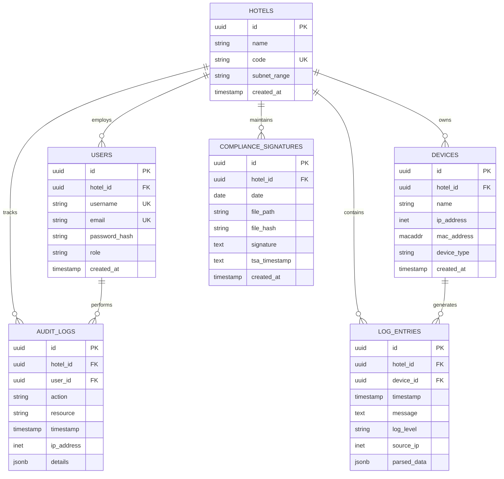

# LogMaster v2 - Clean Multi-Tenant Database Schema

## 🗄️ **Basit ve Etkili Database Schema**

**LogMaster v2** - Otel zincirleri için **multi-tenant** yapı ile **5651 uyumlu** temiz schema.

## 📊 **Entity Relationship Diagram**

### **🏨 Multi-Tenant Hotel Schema**



## 🏨 **Hotel Management Tables**

### **1. Hotels Table**
```sql
-- Ana otel yönetimi tablosu
CREATE TABLE hotels (
    id UUID PRIMARY KEY DEFAULT gen_random_uuid(),
    name VARCHAR(255) NOT NULL,
    code VARCHAR(50) UNIQUE NOT NULL,
    subnet_range CIDR NOT NULL,
    created_at TIMESTAMP WITH TIME ZONE DEFAULT NOW(),
    updated_at TIMESTAMP WITH TIME ZONE DEFAULT NOW()
);

-- Indexes
CREATE INDEX idx_hotels_code ON hotels(code);
CREATE INDEX idx_hotels_subnet ON hotels USING GIST(subnet_range);

-- Example data
INSERT INTO hotels (name, code, subnet_range) VALUES
('İstanbul Grand Hotel', 'IST-001', '192.168.1.0/24'),
('Ankara Business Hotel', 'ANK-001', '192.168.2.0/24'),
('İzmir Resort Hotel', 'IZM-001', '192.168.3.0/24');
```

### **2. Users Table (Multi-tenant)**
```sql
-- Hotel bazlı kullanıcı yönetimi
CREATE TABLE users (
    id UUID PRIMARY KEY DEFAULT gen_random_uuid(),
    hotel_id UUID REFERENCES hotels(id) ON DELETE CASCADE,
    username VARCHAR(50) UNIQUE NOT NULL,
    email VARCHAR(255) UNIQUE NOT NULL,
    password_hash VARCHAR(255) NOT NULL,
    role VARCHAR(50) NOT NULL CHECK (role IN ('chain_admin', 'hotel_manager', 'viewer')),
    created_at TIMESTAMP WITH TIME ZONE DEFAULT NOW(),
    updated_at TIMESTAMP WITH TIME ZONE DEFAULT NOW()
);

-- Indexes
CREATE INDEX idx_users_hotel ON users(hotel_id);
CREATE INDEX idx_users_role ON users(role);
CREATE UNIQUE INDEX idx_users_hotel_username ON users(hotel_id, username);
```

### **3. Devices Table (Mikrotik)**
```sql
-- Mikrotik cihaz yönetimi
CREATE TABLE devices (
    id UUID PRIMARY KEY DEFAULT gen_random_uuid(),
    hotel_id UUID REFERENCES hotels(id) ON DELETE CASCADE,
    name VARCHAR(255) NOT NULL,
    ip_address INET NOT NULL,
    mac_address MACADDR,
    device_type VARCHAR(50) DEFAULT 'mikrotik',
    created_at TIMESTAMP WITH TIME ZONE DEFAULT NOW(),
    updated_at TIMESTAMP WITH TIME ZONE DEFAULT NOW()
);

-- Indexes
CREATE INDEX idx_devices_hotel ON devices(hotel_id);
CREATE INDEX idx_devices_ip ON devices(ip_address);
CREATE UNIQUE INDEX idx_devices_hotel_ip ON devices(hotel_id, ip_address);
```

## 📊 **Log Management Tables**

### **4. Log Entries Table (Partitioned)**
```sql
-- Ana log tablosu (hotel bazlı partitioned)
CREATE TABLE log_entries (
    id UUID DEFAULT gen_random_uuid(),
    hotel_id UUID NOT NULL REFERENCES hotels(id),
    device_id UUID REFERENCES devices(id),
    timestamp TIMESTAMP WITH TIME ZONE NOT NULL,
    message TEXT NOT NULL,
    log_level VARCHAR(20),
    source_ip INET,
    parsed_data JSONB DEFAULT '{}',
    PRIMARY KEY (id, hotel_id)
) PARTITION BY LIST (hotel_id);

-- Hotel bazlı partitions oluştur
CREATE TABLE log_entries_hotel_ist PARTITION OF log_entries
    FOR VALUES IN ('hotel-istanbul-uuid');

CREATE TABLE log_entries_hotel_ank PARTITION OF log_entries
    FOR VALUES IN ('hotel-ankara-uuid');

CREATE TABLE log_entries_hotel_izm PARTITION OF log_entries
    FOR VALUES IN ('hotel-izmir-uuid');

-- Indexes for each partition
CREATE INDEX idx_log_entries_hotel_ist_time ON log_entries_hotel_ist(timestamp DESC);
CREATE INDEX idx_log_entries_hotel_ank_time ON log_entries_hotel_ank(timestamp DESC);
CREATE INDEX idx_log_entries_hotel_izm_time ON log_entries_hotel_izm(timestamp DESC);
```

## ⚖️ **5651 Compliance Tables**

### **5. Compliance Signatures Table**
```sql
-- Günlük imzalama kayıtları
CREATE TABLE compliance_signatures (
    id UUID PRIMARY KEY DEFAULT gen_random_uuid(),
    hotel_id UUID NOT NULL REFERENCES hotels(id),
    date DATE NOT NULL,
    file_path VARCHAR(500) NOT NULL,
    file_hash VARCHAR(64) NOT NULL,
    signature TEXT NOT NULL,
    tsa_timestamp TEXT,
    created_at TIMESTAMP WITH TIME ZONE DEFAULT NOW()
);

-- Indexes
CREATE INDEX idx_compliance_hotel_date ON compliance_signatures(hotel_id, date DESC);
CREATE UNIQUE INDEX idx_compliance_hotel_daily ON compliance_signatures(hotel_id, date);
```

### **6. Audit Logs Table**
```sql
-- Kullanıcı aktivite takibi
CREATE TABLE audit_logs (
    id UUID PRIMARY KEY DEFAULT gen_random_uuid(),
    hotel_id UUID REFERENCES hotels(id),
    user_id UUID REFERENCES users(id),
    action VARCHAR(100) NOT NULL,
    resource VARCHAR(100),
    timestamp TIMESTAMP WITH TIME ZONE DEFAULT NOW(),
    ip_address INET,
    details JSONB DEFAULT '{}'
);

-- Indexes
CREATE INDEX idx_audit_hotel_time ON audit_logs(hotel_id, timestamp DESC);
CREATE INDEX idx_audit_user ON audit_logs(user_id);
```

## 🔧 **Database Functions & Triggers**

### **Hotel Identification Function**
```sql
-- IP adresinden otel bulma
CREATE OR REPLACE FUNCTION get_hotel_by_ip(ip_addr INET)
RETURNS UUID AS $$
DECLARE
    hotel_uuid UUID;
BEGIN
    SELECT id INTO hotel_uuid
    FROM hotels 
    WHERE ip_addr <<= subnet_range
    LIMIT 1;
    
    RETURN hotel_uuid;
END;
$$ LANGUAGE plpgsql;

-- Usage example
SELECT get_hotel_by_ip('192.168.1.1'::INET);
```

### **Auto-partition Creation**
```sql
-- Yeni otel eklendiğinde otomatik partition oluştur
CREATE OR REPLACE FUNCTION create_hotel_partition()
RETURNS TRIGGER AS $$
BEGIN
    EXECUTE format('
        CREATE TABLE log_entries_hotel_%s PARTITION OF log_entries
        FOR VALUES IN (%L)',
        NEW.code, NEW.id
    );
    
    EXECUTE format('
        CREATE INDEX idx_log_entries_hotel_%s_time 
        ON log_entries_hotel_%s(timestamp DESC)',
        NEW.code, NEW.code
    );
    
    RETURN NEW;
END;
$$ LANGUAGE plpgsql;

CREATE TRIGGER trigger_create_hotel_partition
    AFTER INSERT ON hotels
    FOR EACH ROW
    EXECUTE FUNCTION create_hotel_partition();
```

### **Updated Timestamp Trigger**
```sql
-- Otomatik updated_at güncellemesi
CREATE OR REPLACE FUNCTION update_timestamp()
RETURNS TRIGGER AS $$
BEGIN
    NEW.updated_at = NOW();
    RETURN NEW;
END;
$$ LANGUAGE plpgsql;

-- Apply to all tables with updated_at
CREATE TRIGGER trigger_update_hotels_timestamp
    BEFORE UPDATE ON hotels
    FOR EACH ROW
    EXECUTE FUNCTION update_timestamp();

CREATE TRIGGER trigger_update_users_timestamp
    BEFORE UPDATE ON users
    FOR EACH ROW
    EXECUTE FUNCTION update_timestamp();

CREATE TRIGGER trigger_update_devices_timestamp
    BEFORE UPDATE ON devices
    FOR EACH ROW
    EXECUTE FUNCTION update_timestamp();
```

## 🏨 **Multi-Tenant Queries**

### **Tenant-Aware Queries**
```sql
-- Hotel manager sadece kendi otelini görebilir
CREATE OR REPLACE VIEW user_accessible_logs AS
SELECT 
    l.*,
    d.name as device_name,
    h.name as hotel_name
FROM log_entries l
JOIN devices d ON l.device_id = d.id
JOIN hotels h ON l.hotel_id = h.id;

-- Chain admin tüm otelleri görebilir
CREATE OR REPLACE FUNCTION get_logs_for_user(user_uuid UUID, limit_count INT DEFAULT 100)
RETURNS TABLE(
    log_id UUID,
    hotel_name VARCHAR,
    device_name VARCHAR,
    timestamp TIMESTAMP WITH TIME ZONE,
    message TEXT,
    log_level VARCHAR
) AS $$
DECLARE
    user_role VARCHAR;
    user_hotel UUID;
BEGIN
    -- Kullanıcı bilgilerini al
    SELECT role, hotel_id INTO user_role, user_hotel
    FROM users WHERE id = user_uuid;
    
    -- Role'e göre sorgu yap
    IF user_role = 'chain_admin' THEN
        -- Tüm otellerin logları
        RETURN QUERY
        SELECT l.id, h.name, d.name, l.timestamp, l.message, l.log_level
        FROM log_entries l
        JOIN devices d ON l.device_id = d.id
        JOIN hotels h ON l.hotel_id = h.id
        ORDER BY l.timestamp DESC
        LIMIT limit_count;
    ELSE
        -- Sadece kendi otelinin logları
        RETURN QUERY
        SELECT l.id, h.name, d.name, l.timestamp, l.message, l.log_level
        FROM log_entries l
        JOIN devices d ON l.device_id = d.id
        JOIN hotels h ON l.hotel_id = h.id
        WHERE l.hotel_id = user_hotel
        ORDER BY l.timestamp DESC
        LIMIT limit_count;
    END IF;
END;
$$ LANGUAGE plpgsql;
```

### **Performance Optimized Queries**
```sql
-- Hotel bazlı günlük log sayısı
SELECT 
    h.name as hotel_name,
    DATE(l.timestamp) as log_date,
    COUNT(*) as log_count
FROM hotels h
LEFT JOIN log_entries l ON h.id = l.hotel_id
    AND l.timestamp >= CURRENT_DATE - INTERVAL '7 days'
GROUP BY h.id, h.name, DATE(l.timestamp)
ORDER BY log_date DESC, hotel_name;

-- Son 24 saatin en aktif cihazları
SELECT 
    h.name as hotel_name,
    d.name as device_name,
    d.ip_address,
    COUNT(*) as log_count
FROM log_entries l
JOIN devices d ON l.device_id = d.id
JOIN hotels h ON l.hotel_id = h.id
WHERE l.timestamp >= NOW() - INTERVAL '24 hours'
GROUP BY h.id, h.name, d.id, d.name, d.ip_address
ORDER BY log_count DESC
LIMIT 20;
```

## 📊 **Database Setup Script**

### **Complete Database Initialization**
```sql
-- LogMaster v2 Database Setup Script

-- 1. Create database
CREATE DATABASE logmaster_v2;
\c logmaster_v2;

-- 2. Enable extensions
CREATE EXTENSION IF NOT EXISTS "uuid-ossp";
CREATE EXTENSION IF NOT EXISTS "pg_trgm";

-- 3. Create tables (in order)
\i create_hotels.sql
\i create_users.sql
\i create_devices.sql
\i create_log_entries.sql
\i create_compliance_signatures.sql
\i create_audit_logs.sql

-- 4. Create functions and triggers
\i create_functions.sql
\i create_triggers.sql

-- 5. Create views
\i create_views.sql

-- 6. Insert sample data
\i insert_sample_data.sql

-- 7. Create indexes
\i create_indexes.sql

COMMIT;
```

### **Sample Data Insertion**
```sql
-- Sample data for testing
BEGIN;

-- Insert hotels
INSERT INTO hotels (id, name, code, subnet_range) VALUES
('550e8400-e29b-41d4-a716-446655440001', 'İstanbul Grand Hotel', 'IST-001', '192.168.1.0/24'),
('550e8400-e29b-41d4-a716-446655440002', 'Ankara Business Hotel', 'ANK-001', '192.168.2.0/24'),
('550e8400-e29b-41d4-a716-446655440003', 'İzmir Resort Hotel', 'IZM-001', '192.168.3.0/24');

-- Insert users
INSERT INTO users (hotel_id, username, email, password_hash, role) VALUES
(NULL, 'chain_admin', 'admin@hotelchain.com', '$2b$12$hash...', 'chain_admin'),
('550e8400-e29b-41d4-a716-446655440001', 'istanbul_manager', 'mgr@istanbul.com', '$2b$12$hash...', 'hotel_manager'),
('550e8400-e29b-41d4-a716-446655440002', 'ankara_manager', 'mgr@ankara.com', '$2b$12$hash...', 'hotel_manager'),
('550e8400-e29b-41d4-a716-446655440003', 'izmir_manager', 'mgr@izmir.com', '$2b$12$hash...', 'hotel_manager');

-- Insert devices
INSERT INTO devices (hotel_id, name, ip_address, mac_address, device_type) VALUES
('550e8400-e29b-41d4-a716-446655440001', 'Istanbul Router', '192.168.1.1', 'AA:BB:CC:DD:EE:01', 'router'),
('550e8400-e29b-41d4-a716-446655440001', 'Istanbul Switch', '192.168.1.2', 'AA:BB:CC:DD:EE:02', 'switch'),
('550e8400-e29b-41d4-a716-446655440001', 'Istanbul AP', '192.168.1.3', 'AA:BB:CC:DD:EE:03', 'access_point'),
('550e8400-e29b-41d4-a716-446655440002', 'Ankara Router', '192.168.2.1', 'BB:CC:DD:EE:FF:01', 'router'),
('550e8400-e29b-41d4-a716-446655440002', 'Ankara Switch', '192.168.2.2', 'BB:CC:DD:EE:FF:02', 'switch'),
('550e8400-e29b-41d4-a716-446655440003', 'Izmir Router', '192.168.3.1', 'CC:DD:EE:FF:AA:01', 'router');

COMMIT;
```

## 🔧 **Maintenance & Optimization**

### **Regular Maintenance Tasks**
```sql
-- Weekly table maintenance
DO $$ 
BEGIN
    -- Vacuum and analyze all tables
    PERFORM 'VACUUM ANALYZE ' || schemaname || '.' || tablename 
    FROM pg_tables 
    WHERE schemaname = 'public';
    
    -- Update table statistics
    ANALYZE hotels, users, devices, log_entries, compliance_signatures, audit_logs;
    
    -- Reindex if needed
    REINDEX INDEX CONCURRENTLY idx_log_entries_hotel_ist_time;
    REINDEX INDEX CONCURRENTLY idx_log_entries_hotel_ank_time;
    REINDEX INDEX CONCURRENTLY idx_log_entries_hotel_izm_time;
END $$;
```

### **Performance Monitoring**
```sql
-- Check table sizes
SELECT 
    schemaname,
    tablename,
    pg_size_pretty(pg_total_relation_size(schemaname||'.'||tablename)) as size
FROM pg_tables 
WHERE schemaname = 'public'
ORDER BY pg_total_relation_size(schemaname||'.'||tablename) DESC;

-- Check index usage
SELECT 
    indexrelname as index_name,
    idx_tup_read,
    idx_tup_fetch,
    idx_scan
FROM pg_stat_user_indexes
ORDER BY idx_scan DESC;
```

Bu **temiz ve basit database schema** ile LogMaster v2:
- 🏨 **Perfect multi-tenancy** - Hotel bazlı veri izolasyonu
- ⚡ **High performance** - Partitioned tables ile hızlı sorgular
- 🔐 **Secure isolation** - Kullanıcı-hotel seviyesinde erişim
- ⚖️ **5651 compliance** - Günlük imzalama ve audit trail
- 📊 **Easy maintenance** - Basit ve anlaşılır yapı

**Sade, hızlı ve güvenilir!** 🚀 