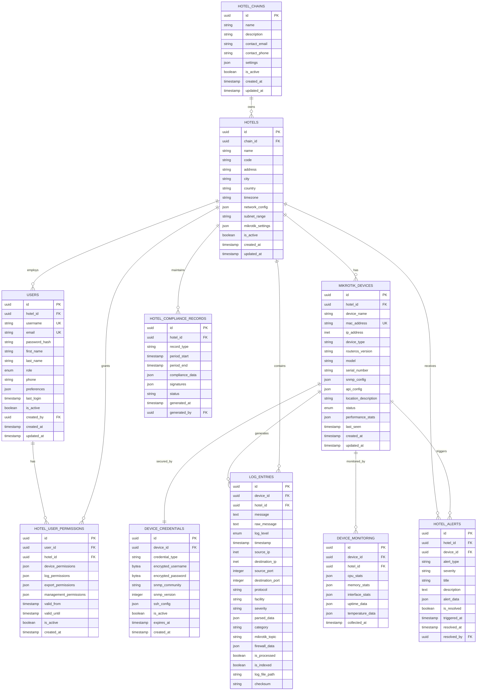

# LogMaster v2 - Database Schema Architecture

## 🗄️ Multi-Tenant Database Schema

LogMaster v2 implements a comprehensive database schema optimized for **multi-tenant hotel management** with **Mikrotik device support** and granular device-level permissions.

## 🏨 **Hotel Chain Multi-Tenancy Schema**



## 🏨 **Hotel Management Tables**

### `hotel_chains`
Hotel zinciri yönetimi için ana tablo:
```sql
CREATE TABLE hotel_chains (
    id UUID PRIMARY KEY DEFAULT gen_random_uuid(),
    name VARCHAR(255) NOT NULL,
    description TEXT,
    contact_email VARCHAR(255),
    contact_phone VARCHAR(50),
    settings JSONB DEFAULT '{}',
    is_active BOOLEAN DEFAULT true,
    created_at TIMESTAMP WITH TIME ZONE DEFAULT NOW(),
    updated_at TIMESTAMP WITH TIME ZONE DEFAULT NOW()
);

CREATE INDEX idx_hotel_chains_name ON hotel_chains(name);
CREATE INDEX idx_hotel_chains_active ON hotel_chains(is_active);
```

### `hotels`
Her otel için ayrı tenant bilgileri:
```sql
CREATE TABLE hotels (
    id UUID PRIMARY KEY DEFAULT gen_random_uuid(),
    chain_id UUID REFERENCES hotel_chains(id),
    name VARCHAR(255) NOT NULL,
    code VARCHAR(50) UNIQUE NOT NULL,
    address TEXT,
    city VARCHAR(100),
    country VARCHAR(100),
    timezone VARCHAR(50) DEFAULT 'Europe/Istanbul',
    network_config JSONB DEFAULT '{}',
    subnet_range CIDR,
    mikrotik_settings JSONB DEFAULT '{}',
    is_active BOOLEAN DEFAULT true,
    created_at TIMESTAMP WITH TIME ZONE DEFAULT NOW(),
    updated_at TIMESTAMP WITH TIME ZONE DEFAULT NOW()
);

CREATE INDEX idx_hotels_chain ON hotels(chain_id);
CREATE INDEX idx_hotels_code ON hotels(code);
CREATE INDEX idx_hotels_active ON hotels(is_active);
```

### `users` (Hotel-Specific)
Hotel bazlı kullanıcı yönetimi:
```sql
CREATE TABLE users (
    id UUID PRIMARY KEY DEFAULT gen_random_uuid(),
    hotel_id UUID REFERENCES hotels(id),
    username VARCHAR(50) UNIQUE NOT NULL,
    email VARCHAR(255) UNIQUE NOT NULL,
    password_hash VARCHAR(255) NOT NULL,
    first_name VARCHAR(100),
    last_name VARCHAR(100),
    role user_role_enum NOT NULL,
    phone VARCHAR(50),
    preferences JSONB DEFAULT '{}',
    last_login TIMESTAMP WITH TIME ZONE,
    is_active BOOLEAN DEFAULT true,
    created_by UUID REFERENCES users(id),
    created_at TIMESTAMP WITH TIME ZONE DEFAULT NOW(),
    updated_at TIMESTAMP WITH TIME ZONE DEFAULT NOW()
);

CREATE TYPE user_role_enum AS ENUM (
    'chain_admin',    -- Tüm zincire erişim
    'hotel_manager',  -- Tek oteli yönetir
    'hotel_viewer',   -- Sadece görüntüler
    'device_admin',   -- Cihaz yöneticisi
    'compliance_officer'
);
```

## 📡 **Mikrotik Device Management**

### `mikrotik_devices`
Mikrotik cihazları için özel tablo:
```sql
CREATE TABLE mikrotik_devices (
    id UUID PRIMARY KEY DEFAULT gen_random_uuid(),
    hotel_id UUID REFERENCES hotels(id) NOT NULL,
    device_name VARCHAR(255) NOT NULL,
    mac_address MACADDR UNIQUE NOT NULL,
    ip_address INET NOT NULL,
    device_type mikrotik_device_type NOT NULL,
    routeros_version VARCHAR(50),
    model VARCHAR(100),
    serial_number VARCHAR(100),
    snmp_config JSONB DEFAULT '{}',
    api_config JSONB DEFAULT '{}',
    location_description TEXT,
    status device_status_enum DEFAULT 'active',
    performance_stats JSONB DEFAULT '{}',
    last_seen TIMESTAMP WITH TIME ZONE DEFAULT NOW(),
    created_at TIMESTAMP WITH TIME ZONE DEFAULT NOW(),
    updated_at TIMESTAMP WITH TIME ZONE DEFAULT NOW()
);

CREATE TYPE mikrotik_device_type AS ENUM (
    'router',
    'switch', 
    'access_point',
    'firewall',
    'bridge',
    'other'
);

CREATE TYPE device_status_enum AS ENUM (
    'active',
    'inactive',
    'maintenance',
    'error',
    'unknown'
);

CREATE INDEX idx_mikrotik_hotel ON mikrotik_devices(hotel_id);
CREATE INDEX idx_mikrotik_mac ON mikrotik_devices(mac_address);
CREATE INDEX idx_mikrotik_ip ON mikrotik_devices(ip_address);
CREATE INDEX idx_mikrotik_status ON mikrotik_devices(status);
```

### `device_credentials`
Mikrotik cihaz bağlantı bilgileri (şifreli):
```sql
CREATE TABLE device_credentials (
    id UUID PRIMARY KEY DEFAULT gen_random_uuid(),
    device_id UUID REFERENCES mikrotik_devices(id) NOT NULL,
    credential_type VARCHAR(50) NOT NULL, -- 'ssh', 'api', 'snmp'
    encrypted_username BYTEA,
    encrypted_password BYTEA,
    snmp_community VARCHAR(255),
    snmp_version INTEGER DEFAULT 2,
    ssh_config JSONB DEFAULT '{}',
    is_active BOOLEAN DEFAULT true,
    expires_at TIMESTAMP WITH TIME ZONE,
    created_at TIMESTAMP WITH TIME ZONE DEFAULT NOW()
);

CREATE INDEX idx_device_credentials_device ON device_credentials(device_id);
CREATE INDEX idx_device_credentials_type ON device_credentials(credential_type);
```

## 🔐 **Hotel-Based Permissions**

### `hotel_user_permissions`
Otel bazlı detaylı izinler:
```sql
CREATE TABLE hotel_user_permissions (
    id UUID PRIMARY KEY DEFAULT gen_random_uuid(),
    user_id UUID REFERENCES users(id) NOT NULL,
    hotel_id UUID REFERENCES hotels(id) NOT NULL,
    device_permissions JSONB DEFAULT '{}',
    log_permissions JSONB DEFAULT '{}',
    export_permissions JSONB DEFAULT '{}',
    management_permissions JSONB DEFAULT '{}',
    valid_from TIMESTAMP WITH TIME ZONE DEFAULT NOW(),
    valid_until TIMESTAMP WITH TIME ZONE,
    is_active BOOLEAN DEFAULT true,
    created_at TIMESTAMP WITH TIME ZONE DEFAULT NOW()
);

-- Example permission structure:
-- device_permissions: {"can_add": true, "can_edit": true, "can_delete": false, "allowed_device_types": ["router", "switch"]}
-- log_permissions: {"can_view": true, "can_export": true, "retention_days": 90}
-- export_permissions: {"formats": ["json", "csv"], "max_records": 10000}
-- management_permissions: {"can_manage_users": false, "can_view_stats": true}

CREATE INDEX idx_hotel_permissions_user ON hotel_user_permissions(user_id);
CREATE INDEX idx_hotel_permissions_hotel ON hotel_user_permissions(hotel_id);
CREATE UNIQUE INDEX idx_hotel_permissions_unique ON hotel_user_permissions(user_id, hotel_id);
```

## 📊 **Enhanced Log Management**

### `log_entries` (Hotel-Aware)
Hotel ve Mikrotik özellikli log tablosu:
```sql
CREATE TABLE log_entries (
    id UUID PRIMARY KEY DEFAULT gen_random_uuid(),
    device_id UUID REFERENCES mikrotik_devices(id) NOT NULL,
    hotel_id UUID REFERENCES hotels(id) NOT NULL,
    message TEXT NOT NULL,
    raw_message TEXT,
    log_level log_level_enum NOT NULL,
    timestamp TIMESTAMP WITH TIME ZONE NOT NULL,
    source_ip INET,
    destination_ip INET,
    source_port INTEGER,
    destination_port INTEGER,
    protocol VARCHAR(20),
    facility VARCHAR(50),
    severity VARCHAR(50),
    parsed_data JSONB DEFAULT '{}',
    category VARCHAR(100),
    mikrotik_topic VARCHAR(255), -- RouterOS specific topics
    firewall_data JSONB DEFAULT '{}',
    is_processed BOOLEAN DEFAULT false,
    is_indexed BOOLEAN DEFAULT false,
    log_file_path VARCHAR(500),
    checksum VARCHAR(64)
);

-- Mikrotik specific topics examples:
-- "firewall,info", "dhcp,info", "wireless,info", "system,error", etc.

-- Partitioning by hotel_id and date for performance
CREATE TABLE log_entries_y2024m01 PARTITION OF log_entries
    FOR VALUES FROM ('2024-01-01') TO ('2024-02-01');

CREATE INDEX idx_log_entries_hotel_time ON log_entries(hotel_id, timestamp DESC);
CREATE INDEX idx_log_entries_device_time ON log_entries(device_id, timestamp DESC);
CREATE INDEX idx_log_entries_mikrotik_topic ON log_entries(mikrotik_topic);
CREATE INDEX idx_log_entries_category ON log_entries(category);
```

## 📈 **Monitoring & Alerting**

### `device_monitoring`
Mikrotik cihaz performans izleme:
```sql
CREATE TABLE device_monitoring (
    id UUID PRIMARY KEY DEFAULT gen_random_uuid(),
    device_id UUID REFERENCES mikrotik_devices(id) NOT NULL,
    hotel_id UUID REFERENCES hotels(id) NOT NULL,
    cpu_stats JSONB DEFAULT '{}',
    memory_stats JSONB DEFAULT '{}',
    interface_stats JSONB DEFAULT '{}',
    uptime_data JSONB DEFAULT '{}',
    temperature_data JSONB DEFAULT '{}',
    collected_at TIMESTAMP WITH TIME ZONE DEFAULT NOW()
);

-- Example stats structure:
-- cpu_stats: {"usage_percent": 15.5, "cores": 4}
-- memory_stats: {"total_mb": 1024, "used_mb": 256, "free_mb": 768}
-- interface_stats: {"eth1": {"rx_bytes": 1024000, "tx_bytes": 512000, "errors": 0}}

CREATE INDEX idx_device_monitoring_device_time ON device_monitoring(device_id, collected_at DESC);
CREATE INDEX idx_device_monitoring_hotel_time ON device_monitoring(hotel_id, collected_at DESC);
```

### `hotel_alerts`
Otel bazlı alarm sistemi:
```sql
CREATE TABLE hotel_alerts (
    id UUID PRIMARY KEY DEFAULT gen_random_uuid(),
    hotel_id UUID REFERENCES hotels(id) NOT NULL,
    device_id UUID REFERENCES mikrotik_devices(id),
    alert_type VARCHAR(100) NOT NULL,
    severity alert_severity_enum NOT NULL,
    title VARCHAR(255) NOT NULL,
    description TEXT,
    alert_data JSONB DEFAULT '{}',
    is_resolved BOOLEAN DEFAULT false,
    triggered_at TIMESTAMP WITH TIME ZONE DEFAULT NOW(),
    resolved_at TIMESTAMP WITH TIME ZONE,
    resolved_by UUID REFERENCES users(id)
);

CREATE TYPE alert_severity_enum AS ENUM (
    'critical',
    'high',
    'medium', 
    'low',
    'info'
);

CREATE INDEX idx_hotel_alerts_hotel_time ON hotel_alerts(hotel_id, triggered_at DESC);
CREATE INDEX idx_hotel_alerts_device ON hotel_alerts(device_id);
CREATE INDEX idx_hotel_alerts_severity ON hotel_alerts(severity);
CREATE INDEX idx_hotel_alerts_resolved ON hotel_alerts(is_resolved);
```

## 📋 **Hotel Compliance Management**

### `hotel_compliance_records`
Otel bazlı uyumluluk kayıtları:
```sql
CREATE TABLE hotel_compliance_records (
    id UUID PRIMARY KEY DEFAULT gen_random_uuid(),
    hotel_id UUID REFERENCES hotels(id) NOT NULL,
    record_type compliance_record_type NOT NULL,
    period_start TIMESTAMP WITH TIME ZONE NOT NULL,
    period_end TIMESTAMP WITH TIME ZONE NOT NULL,
    compliance_data JSONB DEFAULT '{}',
    signatures JSONB DEFAULT '{}',
    status VARCHAR(50) DEFAULT 'pending',
    generated_at TIMESTAMP WITH TIME ZONE DEFAULT NOW(),
    generated_by UUID REFERENCES users(id)
);

CREATE TYPE compliance_record_type AS ENUM (
    'daily_summary',
    'monthly_report',
    'annual_report',
    'audit_export',
    'incident_report'
);

CREATE INDEX idx_hotel_compliance_hotel_period ON hotel_compliance_records(hotel_id, period_start DESC);
CREATE INDEX idx_hotel_compliance_type ON hotel_compliance_records(record_type);
```

## 🔍 **Sample Multi-Tenant Queries**

### Hotel Manager Queries
```sql
-- Otel yöneticisi sadece kendi otelinin loglarını görebilir
SELECT l.*, d.device_name, d.ip_address
FROM log_entries l
JOIN mikrotik_devices d ON l.device_id = d.id
WHERE l.hotel_id = :user_hotel_id
AND l.timestamp >= NOW() - INTERVAL '24 hours'
ORDER BY l.timestamp DESC;

-- Otel yöneticisi kendi otelinin cihazlarını yönetebilir
SELECT * FROM mikrotik_devices 
WHERE hotel_id = :user_hotel_id
AND status = 'active';
```

### Chain Admin Queries
```sql
-- Zincir yöneticisi tüm otellerin özetini görebilir
SELECT 
    h.name as hotel_name,
    COUNT(d.id) as device_count,
    COUNT(l.id) as daily_log_count
FROM hotels h
LEFT JOIN mikrotik_devices d ON h.id = d.hotel_id
LEFT JOIN log_entries l ON h.id = l.hotel_id 
    AND l.timestamp >= CURRENT_DATE
WHERE h.chain_id = :chain_id
GROUP BY h.id, h.name;
```

This enhanced schema supports **complete multi-tenant hotel management** with **Mikrotik-specific features** while maintaining **data isolation** and **granular permissions**. 