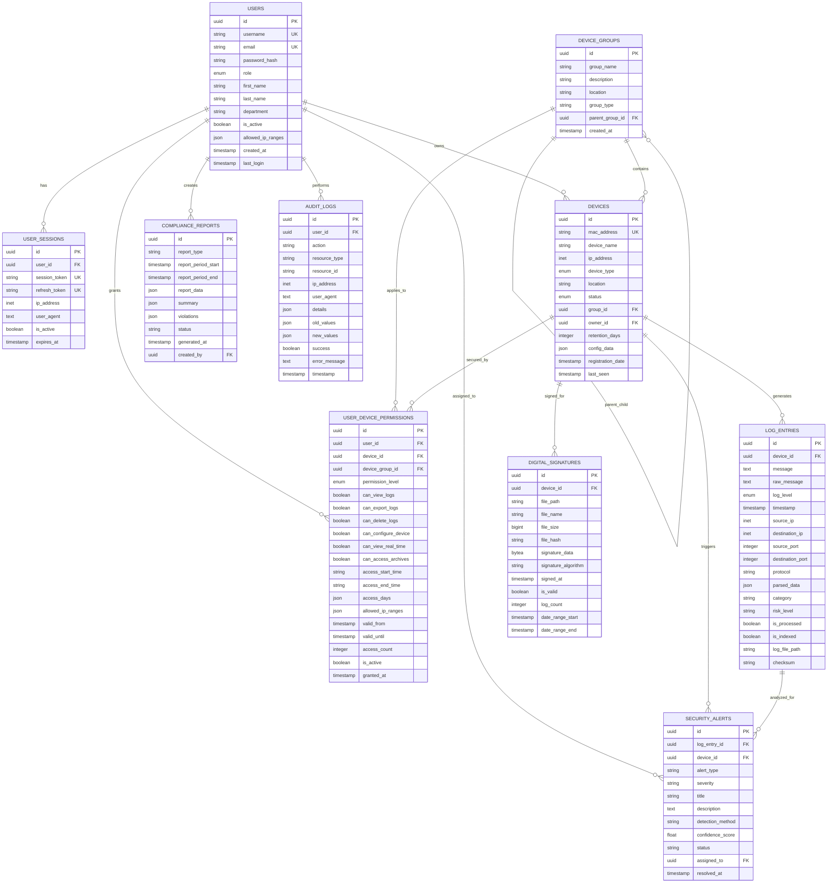

# LogMaster v2 - Database Schema

## 🗄️ Database Design Overview

LogMaster v2 uses a multi-database architecture optimized for enterprise log management with granular device permissions and 5651 compliance.

## 📊 Entity Relationship Diagram



## 📋 Table Descriptions

### 👥 Users & Authentication

#### `users`
Central user management with enhanced security features:
- **UUID primary keys** for better security
- **Role-based classification** (admin, network_manager, security_analyst, etc.)
- **LDAP integration** support with external_id
- **IP restriction** capabilities with JSONB arrays
- **Account lockout** mechanism for failed login attempts
- **Two-factor authentication** support

#### `user_sessions`
Comprehensive session tracking for security auditing:
- **Session tokens** with expiration
- **Device fingerprinting** for security
- **IP tracking** for location monitoring
- **Active session management**

### 📱 Device Management

#### `device_groups`
Hierarchical device organization:
- **Self-referencing** for parent-child relationships
- **Location-based** grouping (building, floor, room)
- **Function-based** grouping (firewall, router, switch)
- **Security-level** grouping (critical, high, medium, low)

#### `devices`
Enhanced device registration with MAC-based authentication:
- **MAC address** as unique identifier
- **Network information** (IP, hostname, port)
- **Hardware details** (manufacturer, model, firmware)
- **Status tracking** (pending, active, inactive, maintenance)
- **Configuration storage** in JSONB format
- **Flexible tagging** system

### 🔐 Permission Management

#### `user_device_permissions`
Granular device-specific permissions:
- **Multiple permission levels** (read, write, admin, owner)
- **Action-based permissions** for specific operations
- **Time-based restrictions** (hours, days, date ranges)
- **IP-based restrictions** with CIDR notation support
- **Usage tracking** (access count, last accessed)
- **Audit trail** (granted by, granted at)

### 📊 Log Management

#### `log_entries`
Comprehensive log storage with enhanced metadata:
- **Device relationship** for log source tracking
- **Parsed data** in JSONB for flexible querying
- **Network information** (source/destination IP and ports)
- **Security classification** (risk level, category)
- **Processing status** tracking
- **File system integration** with path and checksum

### ⚖️ Compliance & Security

#### `digital_signatures`
5651 compliance digital signatures:
- **File integrity** with SHA-256 hashing
- **RSA signature** data storage
- **TSA timestamping** support
- **Verification status** tracking
- **Date range coverage** for compliance periods

#### `compliance_reports`
Automated compliance reporting:
- **Multiple report types** (daily, weekly, monthly, yearly)
- **Structured data** in JSONB format
- **Violation tracking** and recommendations
- **Approval workflow** with multiple reviewers

#### `security_alerts`
Advanced threat detection and alerting:
- **ML-based detection** with confidence scoring
- **Alert management** workflow
- **False positive** tracking
- **Assignment and resolution** tracking

#### `audit_logs`
Comprehensive activity auditing:
- **Complete action tracking** for all user activities
- **Before/after values** for change tracking
- **Session correlation** with IP and user agent
- **Success/failure** tracking with error details

## 🔍 Database Indexes

### Performance Indexes
```sql
-- Users
CREATE INDEX idx_users_username ON users(username);
CREATE INDEX idx_users_email ON users(email);
CREATE INDEX idx_users_role ON users(role);
CREATE INDEX idx_users_active ON users(is_active);

-- Devices
CREATE INDEX idx_devices_mac ON devices(mac_address);
CREATE INDEX idx_devices_status ON devices(status);
CREATE INDEX idx_devices_type ON devices(device_type);
CREATE INDEX idx_devices_location ON devices(location);
CREATE INDEX idx_devices_last_seen ON devices(last_seen);

-- Permissions
CREATE INDEX idx_permissions_user ON user_device_permissions(user_id);
CREATE INDEX idx_permissions_device ON user_device_permissions(device_id);
CREATE INDEX idx_permissions_active ON user_device_permissions(is_active);
CREATE INDEX idx_permissions_expires ON user_device_permissions(valid_until);

-- Log Entries
CREATE INDEX idx_logs_device ON log_entries(device_id);
CREATE INDEX idx_logs_timestamp ON log_entries(timestamp);
CREATE INDEX idx_logs_source_ip ON log_entries(source_ip);
CREATE INDEX idx_logs_level ON log_entries(log_level);
CREATE INDEX idx_logs_category ON log_entries(category);

-- Audit Logs
CREATE INDEX idx_audit_user ON audit_logs(user_id);
CREATE INDEX idx_audit_timestamp ON audit_logs(timestamp);
CREATE INDEX idx_audit_action ON audit_logs(action);
CREATE INDEX idx_audit_resource ON audit_logs(resource_type, resource_id);
```

### Unique Constraints
```sql
-- Unique constraints for data integrity
ALTER TABLE users ADD CONSTRAINT uk_users_username UNIQUE (username);
ALTER TABLE users ADD CONSTRAINT uk_users_email UNIQUE (email);
ALTER TABLE devices ADD CONSTRAINT uk_devices_mac UNIQUE (mac_address);
ALTER TABLE user_sessions ADD CONSTRAINT uk_sessions_token UNIQUE (session_token);
ALTER TABLE user_device_permissions ADD CONSTRAINT uk_user_device UNIQUE (user_id, device_id);
```

## 🚀 Database Performance Considerations

### Connection Pooling
- **Pool size**: 20 connections
- **Max overflow**: 30 connections
- **Pool timeout**: 30 seconds
- **Connection recycling**: 1 hour

### Query Optimization
- **Prepared statements** for frequent queries
- **Connection pooling** for concurrent access
- **Query result caching** with Redis
- **Batch operations** for bulk inserts

### Scaling Strategy
- **Read replicas** for read-heavy workloads
- **Partitioning** for large tables (log_entries, audit_logs)
- **Archival strategy** for old data
- **Backup and recovery** procedures

## 🔒 Security Considerations

### Data Encryption
- **At-rest encryption** for sensitive columns
- **SSL/TLS connections** for all database access
- **Password hashing** with bcrypt
- **Token encryption** for session management

### Access Control
- **Database user roles** with minimal privileges
- **Application-level security** with ORM
- **Audit logging** for all database changes
- **Regular security updates** and patches

### Backup Strategy
- **Daily automated backups**
- **Point-in-time recovery** capability
- **Offsite backup storage**
- **Regular restore testing** 