# LogMaster v2 - Production Deployment Architecture

## 🏭 Enterprise Production Architecture

LogMaster v2 is designed for enterprise-scale deployment with high availability, disaster recovery, and scalability in mind.

## 🗂️ Production Infrastructure Diagram

```mermaid
graph TB
    subgraph "PRODUCTION ENVIRONMENT"
        subgraph "LOAD BALANCER"
            LB["⚖️ Nginx Load Balancer<br/>SSL Termination<br/>Port 80/443"]
        end
        
        subgraph "WEB TIER"
            WEB1["🌐 Web Server 1<br/>Nginx + React"]
            WEB2["🌐 Web Server 2<br/>Nginx + React"]
        end
        
        subgraph "APPLICATION TIER"
            APP1["🚀 FastAPI App 1<br/>Port 8000"]
            APP2["🚀 FastAPI App 2<br/>Port 8001"]
            APP3["🚀 FastAPI App 3<br/>Port 8002"]
        end
        
        subgraph "DATABASE TIER"
            PG_MASTER["🐘 PostgreSQL Master<br/>Primary Database"]
            PG_SLAVE1["🐘 PostgreSQL Slave 1<br/>Read Replica"]
            PG_SLAVE2["🐘 PostgreSQL Slave 2<br/>Read Replica"]
        end
        
        subgraph "SEARCH TIER"
            ES_MASTER["🔍 Elasticsearch Master<br/>Cluster Coordinator"]
            ES_DATA1["🔍 Elasticsearch Data 1<br/>Data Node"]
            ES_DATA2["🔍 Elasticsearch Data 2<br/>Data Node"]
            ES_DATA3["🔍 Elasticsearch Data 3<br/>Data Node"]
        end
        
        subgraph "CACHE TIER"
            REDIS_MASTER["⚡ Redis Master<br/>Primary Cache"]
            REDIS_SLAVE["⚡ Redis Slave<br/>Read Cache"]
        end
        
        subgraph "LOG PROCESSING"
            COLLECTOR["📡 Log Collector<br/>Syslog + Filebeat"]
            PROCESSOR1["🔄 Log Processor 1<br/>Parser & Enricher"]
            PROCESSOR2["🔄 Log Processor 2<br/>Parser & Enricher"]
            SIGNER["✍️ Digital Signer<br/>RSA-256 + TSA"]
        end
        
        subgraph "MONITORING TIER"
            PROMETHEUS["📊 Prometheus<br/>Metrics Collection"]
            GRAFANA["📈 Grafana<br/>Dashboards & Alerts"]
            ALERTMANAGER["🔔 Alert Manager<br/>Notification Hub"]
        end
        
        subgraph "STORAGE TIER"
            NFS["📁 NFS Storage<br/>Shared Log Files"]
            BACKUP_PRIMARY["💾 Primary Backup<br/>Daily Snapshots"]
            BACKUP_OFFSITE["🏢 Offsite Backup<br/>Weekly Archives"]
        end
    end
    
    subgraph "EXTERNAL SERVICES"
        TSA_SERVICE["🕐 Time Stamp Authority<br/>RFC 3161 Compliant"]
        LDAP_AD["👥 LDAP/Active Directory<br/>User Authentication"]
        SMTP_SERVER["📧 SMTP Server<br/>Alert Notifications"]
        DNS_SERVER["🌐 DNS Server<br/>Name Resolution"]
    end
    
    subgraph "NETWORK DEVICES"
        FIREWALL1["🔥 Firewall Cluster 1<br/>Location: Istanbul"]
        FIREWALL2["🔥 Firewall Cluster 2<br/>Location: Ankara"]
        FIREWALL3["🔥 Firewall Cluster 3<br/>Location: Izmir"]
        ROUTER_CORE["🔀 Core Router<br/>Network Backbone"]
    end
    
    subgraph "DISASTER RECOVERY"
        DR_SITE["🏥 DR Site<br/>Hot Standby"]
        DR_DATABASE["🗄️ DR Database<br/>Sync Replica"]
        DR_STORAGE["💽 DR Storage<br/>Mirrored Data"]
    end
    
    %% Load Balancer Connections
    LB --> WEB1
    LB --> WEB2
    
    %% Web to App Tier
    WEB1 --> APP1
    WEB1 --> APP2
    WEB2 --> APP2
    WEB2 --> APP3
    
    %% App to Database Connections
    APP1 --> PG_MASTER
    APP2 --> PG_SLAVE1
    APP3 --> PG_SLAVE2
    
    %% Database Replication
    PG_MASTER --> PG_SLAVE1
    PG_MASTER --> PG_SLAVE2
    
    %% App to Search Tier
    APP1 --> ES_MASTER
    APP2 --> ES_MASTER
    APP3 --> ES_MASTER
    
    %% Elasticsearch Cluster
    ES_MASTER --> ES_DATA1
    ES_MASTER --> ES_DATA2
    ES_MASTER --> ES_DATA3
    
    %% App to Cache
    APP1 --> REDIS_MASTER
    APP2 --> REDIS_MASTER
    APP3 --> REDIS_SLAVE
    
    %% Cache Replication
    REDIS_MASTER --> REDIS_SLAVE
    
    %% Log Processing Flow
    FIREWALL1 --> COLLECTOR
    FIREWALL2 --> COLLECTOR
    FIREWALL3 --> COLLECTOR
    ROUTER_CORE --> COLLECTOR
    
    COLLECTOR --> PROCESSOR1
    COLLECTOR --> PROCESSOR2
    
    PROCESSOR1 --> ES_DATA1
    PROCESSOR2 --> ES_DATA2
    PROCESSOR1 --> NFS
    PROCESSOR2 --> NFS
    
    NFS --> SIGNER
    SIGNER --> TSA_SERVICE
    
    %% Monitoring Connections
    APP1 --> PROMETHEUS
    APP2 --> PROMETHEUS
    APP3 --> PROMETHEUS
    PG_MASTER --> PROMETHEUS
    ES_MASTER --> PROMETHEUS
    REDIS_MASTER --> PROMETHEUS
    
    PROMETHEUS --> GRAFANA
    PROMETHEUS --> ALERTMANAGER
    ALERTMANAGER --> SMTP_SERVER
    
    %% External Service Connections
    APP1 --> LDAP_AD
    APP2 --> LDAP_AD
    APP3 --> LDAP_AD
    
    %% Storage and Backup
    NFS --> BACKUP_PRIMARY
    BACKUP_PRIMARY --> BACKUP_OFFSITE
    
    %% Disaster Recovery
    PG_MASTER --> DR_DATABASE
    NFS --> DR_STORAGE
    BACKUP_PRIMARY --> DR_SITE
    
    classDef loadBalancer fill:#e8f5e8,stroke:#4caf50,stroke-width:3px
    classDef webTier fill:#e3f2fd,stroke:#2196f3,stroke-width:2px
    classDef appTier fill:#fff3e0,stroke:#ff9800,stroke-width:2px
    classDef dbTier fill:#f3e5f5,stroke:#9c27b0,stroke-width:2px
    classDef searchTier fill:#e0f2f1,stroke:#009688,stroke-width:2px
    classDef cacheTier fill:#ffebee,stroke:#f44336,stroke-width:2px
    classDef processingTier fill:#e8eaf6,stroke:#3f51b5,stroke-width:2px
    classDef monitorTier fill:#fce4ec,stroke:#e91e63,stroke-width:2px
    classDef storageTier fill:#f1f8e9,stroke:#8bc34a,stroke-width:2px
    classDef external fill:#fff8e1,stroke:#ffc107,stroke-width:2px
    classDef devices fill:#e0f7fa,stroke:#00bcd4,stroke-width:2px
    classDef disaster fill:#fde7f3,stroke:#d81b60,stroke-width:2px
    
    class LB loadBalancer
    class WEB1,WEB2 webTier
    class APP1,APP2,APP3 appTier
    class PG_MASTER,PG_SLAVE1,PG_SLAVE2 dbTier
    class ES_MASTER,ES_DATA1,ES_DATA2,ES_DATA3 searchTier
    class REDIS_MASTER,REDIS_SLAVE cacheTier
    class COLLECTOR,PROCESSOR1,PROCESSOR2,SIGNER processingTier
    class PROMETHEUS,GRAFANA,ALERTMANAGER monitorTier
    class NFS,BACKUP_PRIMARY,BACKUP_OFFSITE storageTier
    class TSA_SERVICE,LDAP_AD,SMTP_SERVER,DNS_SERVER external
    class FIREWALL1,FIREWALL2,FIREWALL3,ROUTER_CORE devices
    class DR_SITE,DR_DATABASE,DR_STORAGE disaster
```

## 🏗️ Infrastructure Components

### ⚖️ Load Balancer Tier
- **Nginx Load Balancer** with SSL termination
- **Health checks** and automatic failover
- **Rate limiting** and DDoS protection
- **SSL certificate management** with Let's Encrypt

### 🌐 Web Server Tier
- **Multiple Nginx instances** for high availability
- **Static content caching** and compression
- **CDN integration** for global performance
- **Auto-scaling** based on traffic

### 🚀 Application Tier
- **FastAPI instances** with load distribution
- **Horizontal scaling** with container orchestration
- **Health monitoring** and automatic recovery
- **Blue-green deployment** support

### 🗄️ Database Tier
- **PostgreSQL master-slave** replication
- **Read/write splitting** for performance
- **Automated failover** with pgpool
- **Point-in-time recovery** capability

### 🔍 Search Tier
- **Elasticsearch cluster** with master/data nodes
- **Index sharding** and replication
- **Cluster monitoring** and health checks
- **Hot/warm architecture** for cost optimization

### ⚡ Cache Tier
- **Redis master-slave** configuration
- **Session management** and API caching
- **High availability** with Redis Sentinel
- **Memory optimization** and eviction policies

## 📊 Capacity Planning

### Server Specifications

#### Load Balancer
- **CPU**: 4 cores (2.5GHz)
- **Memory**: 8GB RAM
- **Storage**: 100GB SSD
- **Network**: 1Gbps

#### Web Servers (2x)
- **CPU**: 8 cores (2.8GHz)
- **Memory**: 16GB RAM
- **Storage**: 200GB SSD
- **Network**: 1Gbps

#### Application Servers (3x)
- **CPU**: 16 cores (3.0GHz)
- **Memory**: 32GB RAM
- **Storage**: 500GB SSD
- **Network**: 10Gbps

#### Database Servers (3x)
- **CPU**: 24 cores (3.2GHz)
- **Memory**: 64GB RAM
- **Storage**: 2TB NVMe SSD
- **Network**: 10Gbps

#### Elasticsearch Nodes (4x)
- **CPU**: 32 cores (3.0GHz)
- **Memory**: 64GB RAM
- **Storage**: 4TB SSD
- **Network**: 10Gbps

#### Storage Server
- **CPU**: 16 cores (2.8GHz)
- **Memory**: 32GB RAM
- **Storage**: 20TB HDD + 2TB SSD cache
- **Network**: 10Gbps

### Performance Targets

| Metric | Target | Notes |
|--------|---------|-------|
| **Response Time** | < 200ms | 95th percentile for API calls |
| **Throughput** | 10,000 logs/sec | Peak log ingestion rate |
| **Availability** | 99.99% | Less than 53 minutes downtime/year |
| **Search Performance** | < 500ms | Complex log searches |
| **Concurrent Users** | 1,000+ | Simultaneous web interface users |
| **Data Retention** | 2+ years | 5651 compliance requirement |

## 🔒 Security Architecture

### Network Security
- **DMZ configuration** with multiple firewall zones
- **VPN access** for administrative tasks
- **Network segmentation** between tiers
- **Intrusion detection** and prevention

### Application Security
- **WAF (Web Application Firewall)** protection
- **SSL/TLS encryption** end-to-end
- **API rate limiting** and throttling
- **Input validation** and sanitization

### Data Security
- **Encryption at rest** for all data stores
- **Database encryption** with transparent data encryption
- **Key management** with hardware security modules
- **Regular security audits** and penetration testing

## 📈 Scalability Strategy

### Horizontal Scaling
- **Container orchestration** with Kubernetes
- **Auto-scaling policies** based on metrics
- **Load balancer auto-discovery** of new instances
- **Database read replica** scaling

### Vertical Scaling
- **CPU and memory upgrades** without downtime
- **Storage expansion** with online resize
- **Network bandwidth** upgrades
- **Performance monitoring** and optimization

### Geographic Distribution
- **Multi-region deployment** for global access
- **Data replication** across regions
- **Edge caching** for improved performance
- **Disaster recovery** site activation

## 🚨 Monitoring & Alerting

### System Monitoring
- **Prometheus** for metrics collection
- **Grafana** for visualization and dashboards
- **AlertManager** for notification routing
- **Custom metrics** for business logic

### Application Monitoring
- **APM (Application Performance Monitoring)**
- **Distributed tracing** across services
- **Error tracking** and notification
- **User experience** monitoring

### Infrastructure Monitoring
- **Server resource** monitoring (CPU, memory, disk)
- **Network performance** and bandwidth usage
- **Database performance** and query analysis
- **Storage capacity** and IOPS monitoring

### Alert Categories

| Alert Level | Response Time | Examples |
|-------------|---------------|----------|
| **Critical** | Immediate | Service down, data corruption |
| **Warning** | 15 minutes | High CPU usage, disk space low |
| **Info** | 1 hour | Deployment completed, user registration |

## 💾 Backup & Disaster Recovery

### Backup Strategy
- **Daily automated backups** of all databases
- **Incremental backups** every 4 hours
- **Log file backups** with compression
- **Configuration backups** before changes

### Recovery Procedures
- **RTO (Recovery Time Objective)**: 4 hours
- **RPO (Recovery Point Objective)**: 1 hour
- **Automated recovery** scripts and procedures
- **Regular disaster recovery** testing

### Offsite Storage
- **Geographic separation** of backup sites
- **Cloud storage** integration
- **Encrypted backup** transmission
- **Long-term archival** for compliance

## 🚀 Deployment Procedures

### CI/CD Pipeline
- **Automated testing** on all commits
- **Security scanning** of code and dependencies
- **Performance testing** before deployment
- **Blue-green deployment** for zero downtime

### Environment Promotion
1. **Development** → Feature testing
2. **Staging** → Integration testing
3. **Pre-production** → Performance testing
4. **Production** → Live deployment

### Rollback Procedures
- **Automated rollback** on health check failure
- **Database migration** rollback scripts
- **Configuration rollback** procedures
- **Emergency rollback** manual procedures

## 📋 Operational Procedures

### Daily Operations
- **Health check** verification
- **Performance metrics** review
- **Security alerts** monitoring
- **Backup verification**

### Weekly Operations
- **Security updates** installation
- **Performance optimization** review
- **Capacity planning** assessment
- **Disaster recovery** testing

### Monthly Operations
- **Security audit** and compliance review
- **Performance benchmarking**
- **Infrastructure cost** optimization
- **Documentation** updates

This production architecture ensures that LogMaster v2 can handle enterprise-scale log management requirements while maintaining high availability, security, and compliance with 5651 Turkish Law. 