# LogMaster v2 - Security & Permission Architecture

## 🔐 Security & Permission Flow

LogMaster v2 implements a comprehensive security architecture with granular device-level permissions and enterprise-grade authentication.

## 🔄 Authentication & Authorization Flow

```mermaid
flowchart TD
    START([🔐 User Login Request]) --> AUTH_CHECK{Authentication Valid?}
    
    AUTH_CHECK -->|❌ No| AUTH_FAIL[🚫 Authentication Failed]
    AUTH_CHECK -->|✅ Yes| JWT_CREATE[🎫 Create JWT Token]
    
    JWT_CREATE --> ROLE_CHECK[👤 Check User Role]
    ROLE_CHECK --> ADMIN_CHECK{Is Admin?}
    
    ADMIN_CHECK -->|✅ Yes| FULL_ACCESS[🔓 Full System Access]
    ADMIN_CHECK -->|❌ No| DEVICE_PERM[🎯 Check Device Permissions]
    
    DEVICE_PERM --> TIME_CHECK{Time Restriction?}
    TIME_CHECK -->|❌ Outside Hours| TIME_FAIL[⏰ Access Denied - Time]
    TIME_CHECK -->|✅ Within Hours| IP_CHECK{IP Restriction?}
    
    IP_CHECK -->|❌ Invalid IP| IP_FAIL[🌐 Access Denied - IP]
    IP_CHECK -->|✅ Valid IP| DEVICE_LIST[📱 Get Authorized Devices]
    
    DEVICE_LIST --> DEVICE_ACCESS{Device Access Request?}
    
    DEVICE_ACCESS -->|📊 View Logs| VIEW_PERM{Can View Logs?}
    DEVICE_ACCESS -->|📤 Export Logs| EXPORT_PERM{Can Export Logs?}
    DEVICE_ACCESS -->|🗑️ Delete Logs| DELETE_PERM{Can Delete Logs?}
    DEVICE_ACCESS -->|⚙️ Configure| CONFIG_PERM{Can Configure?}
    DEVICE_ACCESS -->|📡 Real-time| REALTIME_PERM{Can View Real-time?}
    DEVICE_ACCESS -->|📦 Archives| ARCHIVE_PERM{Can Access Archives?}
    
    VIEW_PERM -->|✅ Yes| VIEW_LOGS[📊 Display Filtered Logs]
    VIEW_PERM -->|❌ No| PERM_DENIED[🚫 Permission Denied]
    
    EXPORT_PERM -->|✅ Yes| EXPORT_LOGS[📤 Export Authorized Data]
    EXPORT_PERM -->|❌ No| PERM_DENIED
    
    DELETE_PERM -->|✅ Yes| DELETE_LOGS[🗑️ Delete with Audit]
    DELETE_PERM -->|❌ No| PERM_DENIED
    
    CONFIG_PERM -->|✅ Yes| CONFIG_DEVICE[⚙️ Device Configuration]
    CONFIG_PERM -->|❌ No| PERM_DENIED
    
    REALTIME_PERM -->|✅ Yes| REALTIME_VIEW[📡 Real-time Monitoring]
    REALTIME_PERM -->|❌ No| PERM_DENIED
    
    ARCHIVE_PERM -->|✅ Yes| ARCHIVE_ACCESS[📦 Archive Access]
    ARCHIVE_PERM -->|❌ No| PERM_DENIED
    
    VIEW_LOGS --> AUDIT_LOG[📋 Log User Activity]
    EXPORT_LOGS --> AUDIT_LOG
    DELETE_LOGS --> AUDIT_LOG
    CONFIG_DEVICE --> AUDIT_LOG
    REALTIME_VIEW --> AUDIT_LOG
    ARCHIVE_ACCESS --> AUDIT_LOG
    PERM_DENIED --> AUDIT_LOG
    
    AUDIT_LOG --> UPDATE_ACCESS[📊 Update Access Counter]
    UPDATE_ACCESS --> END([✅ Access Complete])
    
    AUTH_FAIL --> END
    TIME_FAIL --> AUDIT_LOG
    IP_FAIL --> AUDIT_LOG
    
    classDef startEnd fill:#e8f5e8,stroke:#4caf50,stroke-width:2px
    classDef decision fill:#fff3e0,stroke:#ff9800,stroke-width:2px
    classDef process fill:#e3f2fd,stroke:#2196f3,stroke-width:2px
    classDef permission fill:#f3e5f5,stroke:#9c27b0,stroke-width:2px
    classDef denied fill:#ffebee,stroke:#f44336,stroke-width:2px
    classDef success fill:#e8f5e8,stroke:#4caf50,stroke-width:2px
    
    class START,END startEnd
    class AUTH_CHECK,ADMIN_CHECK,TIME_CHECK,IP_CHECK,DEVICE_ACCESS,VIEW_PERM,EXPORT_PERM,DELETE_PERM,CONFIG_PERM,REALTIME_PERM,ARCHIVE_PERM decision
    class JWT_CREATE,ROLE_CHECK,DEVICE_PERM,DEVICE_LIST,AUDIT_LOG,UPDATE_ACCESS process
    class VIEW_LOGS,EXPORT_LOGS,CONFIG_DEVICE,REALTIME_VIEW,ARCHIVE_ACCESS success
    class AUTH_FAIL,TIME_FAIL,IP_FAIL,PERM_DENIED denied
    class FULL_ACCESS,DELETE_LOGS,ARCHIVE_ACCESS permission
```



## 👥 User Roles & Permission Matrix

### 🎯 Role Definitions

| Role | Description | Access Level | Primary Use Case |
|------|-------------|--------------|------------------|
| **Admin** | System administrators | Full access to all devices and system functions | System management, user administration |
| **Network Manager** | Network infrastructure managers | Network devices and configurations | Network monitoring, device management |
| **Security Analyst** | Security operations team | Security-related logs and alerts | Incident response, threat analysis |
| **Location Manager** | Site or location managers | Location-specific devices only | Local compliance, site monitoring |
| **Device Owner** | Device-specific managers | Specific assigned devices | Device-specific monitoring |
| **Viewer** | Read-only users | View logs only for authorized devices | Reporting, compliance viewing |

### 📊 Permission Matrix

| Permission | Admin | Network Mgr | Security Analyst | Location Mgr | Device Owner | Viewer |
|------------|-------|-------------|------------------|--------------|--------------|--------|
| **View Logs** | ✅ | ✅ | ✅ | ✅ | ✅ | ✅ |
| **Export Logs** | ✅ | ✅ | ✅ | ✅ | ✅ | ❌ |
| **Delete Logs** | ✅ | ✅ | ❌ | ❌ | ❌ | ❌ |
| **Configure Device** | ✅ | ✅ | ❌ | ❌ | ❌ | ❌ |
| **View Real-time** | ✅ | ✅ | ✅ | ✅ | ❌ | ❌ |
| **Access Archives** | ✅ | ✅ | ✅ | ❌ | ❌ | ❌ |
| **Manage Users** | ✅ | ❌ | ❌ | ❌ | ❌ | ❌ |
| **Manage Devices** | ✅ | ✅ | ❌ | ❌ | ❌ | ❌ |
| **Generate Reports** | ✅ | ✅ | ✅ | ✅ | ❌ | ❌ |
| **System Config** | ✅ | ❌ | ❌ | ❌ | ❌ | ❌ |

## 🔐 Device-Level Permissions

### MAC Address Authentication
- Each device is uniquely identified by MAC address
- Device registration requires admin approval
- Automatic device discovery with pending status
- Device grouping for bulk permission management

### Granular Access Control
```python
# Example Permission Structure
{
    "user_id": "uuid",
    "device_id": "uuid", 
    "permissions": {
        "can_view_logs": true,
        "can_export_logs": true,
        "can_delete_logs": false,
        "can_configure_device": false,
        "can_view_real_time": true,
        "can_access_archives": false
    },
    "restrictions": {
        "time_based": {
            "access_start_time": "08:00",
            "access_end_time": "18:00",
            "access_days": ["monday", "tuesday", "wednesday", "thursday", "friday"]
        },
        "ip_based": {
            "allowed_ip_ranges": ["192.168.1.0/24", "10.0.0.0/8"]
        },
        "validity": {
            "valid_from": "2024-01-01",
            "valid_until": "2024-12-31"
        }
    }
}
```

## 🕐 Time-Based Access Control

### Business Hours Restriction
- Configure access windows (e.g., 08:00-18:00)
- Day-of-week restrictions (e.g., Monday-Friday only)
- Holiday calendar integration
- Emergency access procedures

### Date Range Validity
- Permission start and end dates
- Temporary access for contractors
- Automatic permission expiration
- Renewal notification system

## 🌐 IP-Based Access Control

### Network Restrictions
- CIDR notation support (e.g., 192.168.1.0/24)
- Multiple IP range definitions
- VPN network inclusion
- Geographic IP blocking

### Location-Based Access
- Office network access only
- Remote work IP registration
- Mobile device IP tracking
- Suspicious location alerts

## 📋 Audit & Compliance

### Activity Logging
- All user actions logged with timestamps
- Before/after values for changes
- IP address and user agent tracking
- Session correlation and tracking

### Compliance Features
- 5651 Turkish Law compliance
- GDPR data protection compliance
- SOX financial compliance ready
- Custom compliance rule engine

### Audit Reports
- User activity reports
- Permission change reports
- Access violation reports
- Compliance status reports

## 🔒 Security Hardening

### Authentication Security
- Strong password policies
- Multi-factor authentication
- Account lockout mechanisms
- Session timeout controls

### Authorization Security
- Principle of least privilege
- Regular permission reviews
- Automated permission cleanup
- Role-based segregation

### Data Security
- Encryption at rest and in transit
- Digital signature verification
- Data integrity checks
- Secure key management

## 🚨 Security Monitoring

### Threat Detection
- Anomalous access pattern detection
- Failed authentication monitoring
- Unusual data export detection
- Privilege escalation alerts

### Alerting System
- Real-time security alerts
- Email and SMS notifications
- Integration with SIEM systems
- Automated response procedures

### Incident Response
- Security incident workflows
- Automated account suspension
- Forensic data collection
- Compliance reporting

## 🛠️ Implementation Examples

### Creating User with Device Permissions
```python
# Create network manager with specific device access
user = create_user(
    username="network_admin_istanbul",
    role="network_manager",
    email="netadmin.istanbul@company.com"
)

# Grant access to Istanbul firewall cluster
grant_device_permission(
    user_id=user.id,
    device_group="istanbul_firewalls",
    permissions={
        "can_view_logs": True,
        "can_export_logs": True,
        "can_configure_device": True,
        "can_view_real_time": True
    },
    restrictions={
        "access_start_time": "07:00",
        "access_end_time": "19:00",
        "access_days": ["monday", "tuesday", "wednesday", "thursday", "friday"],
        "allowed_ip_ranges": ["192.168.100.0/24"]
    }
)
```

### Checking Device Access
```python
# Check if user can export logs from specific device
can_access = check_device_permission(
    user_id=current_user.id,
    device_mac="AA:BB:CC:DD:EE:01",
    action="export_logs",
    user_ip=request.client.host
)

if not can_access:
    raise HTTPException(403, "Access denied to device")
```

This comprehensive security architecture ensures that LogMaster v2 provides enterprise-grade security while maintaining the granular device-level permissions required for complex organizational structures. 