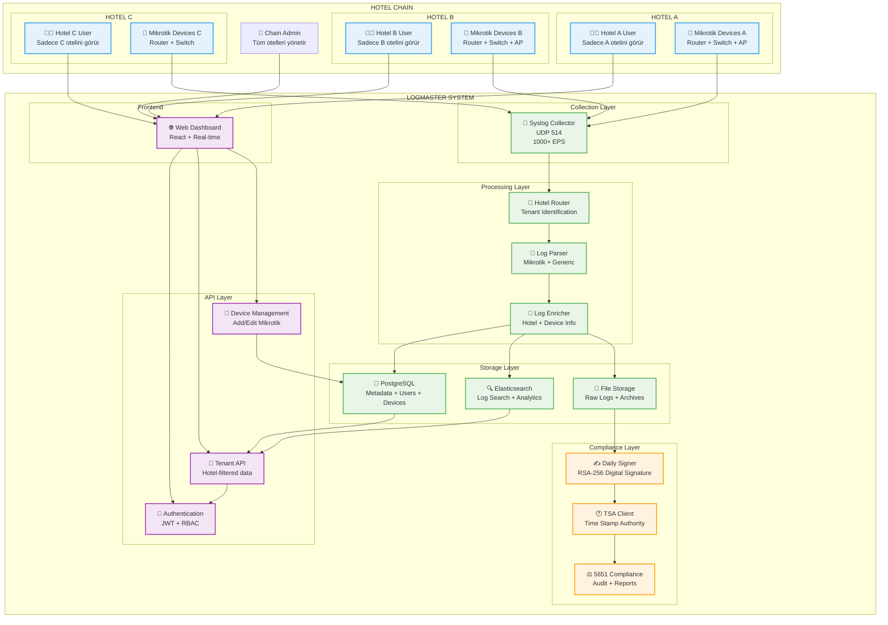

# LogMaster v2 - Multi-Tenant Hotel Chain Log Management

## 🏨 **Temiz ve Basit Multi-Tenant Mimari**

**LogMaster v2** - Otel zincirleri için özel tasarlanmış, **1000+ events/second** performansı ile **5651 uyumlu** log yönetim sistemi.

## 🎯 **Sistem Mimarisi**

### **🏢 Multi-Tenant Hotel Chain Architecture**



## 📊 **Basit ve Etkili Veri Akışı**

### **1. Log Collection (1000+ EPS)**
```
Mikrotik Devices → UDP 514 → Hotel Router → Parser → Storage
```

### **2. Multi-Tenant Processing**
```python
# Basit hotel tanımlama
def identify_hotel(log_entry):
    device_ip = log_entry.get('source_ip')
    device = get_device_by_ip(device_ip)
    return device.hotel_id if device else None

# Tenant izolasyonu
def process_log(raw_log):
    hotel_id = identify_hotel(raw_log)
    if not hotel_id:
        return None
        
    return {
        **raw_log,
        'hotel_id': hotel_id,
        'tenant_namespace': f'hotel_{hotel_id}'
    }
```

### **3. 5651 Compliance Pipeline**
```python
# Günlük imzalama
def daily_compliance_process():
    for hotel in get_active_hotels():
        # Her otel için ayrı günlük dosyası
        daily_file = f"/logs/{hotel.id}/{today}.log"
        
        # SHA-256 hash hesapla
        file_hash = calculate_sha256(daily_file)
        
        # RSA-256 ile imzala
        signature = rsa_sign(file_hash, private_key)
        
        # TSA'dan zaman damgası al
        timestamp = get_tsa_timestamp(file_hash)
        
        # İmza kaydı oluştur
        save_signature_record({
            'hotel_id': hotel.id,
            'date': today,
            'file_path': daily_file,
            'file_hash': file_hash,
            'signature': signature,
            'timestamp': timestamp
        })
```

## 🗄️ **Temiz Database Schema**

### **Temel Tablolar**
```sql
-- Hotel Chain Management
CREATE TABLE hotels (
    id UUID PRIMARY KEY,
    name VARCHAR(255) NOT NULL,
    code VARCHAR(50) UNIQUE,
    created_at TIMESTAMP DEFAULT NOW()
);

-- Multi-tenant Users
CREATE TABLE users (
    id UUID PRIMARY KEY,
    hotel_id UUID REFERENCES hotels(id),
    username VARCHAR(50) UNIQUE,
    email VARCHAR(255),
    role VARCHAR(50), -- 'chain_admin', 'hotel_manager', 'viewer'
    password_hash VARCHAR(255),
    created_at TIMESTAMP DEFAULT NOW()
);

-- Mikrotik Devices
CREATE TABLE devices (
    id UUID PRIMARY KEY,
    hotel_id UUID REFERENCES hotels(id),
    name VARCHAR(255),
    ip_address INET,
    mac_address MACADDR,
    device_type VARCHAR(50),
    created_at TIMESTAMP DEFAULT NOW()
);

-- Log Entries (Partitioned by hotel)
CREATE TABLE log_entries (
    id UUID PRIMARY KEY,
    hotel_id UUID REFERENCES hotels(id),
    device_id UUID REFERENCES devices(id),
    timestamp TIMESTAMP,
    message TEXT,
    log_level VARCHAR(20),
    source_ip INET,
    parsed_data JSONB
) PARTITION BY LIST (hotel_id);

-- 5651 Compliance Records
CREATE TABLE compliance_signatures (
    id UUID PRIMARY KEY,
    hotel_id UUID REFERENCES hotels(id),
    date DATE,
    file_path VARCHAR(500),
    file_hash VARCHAR(64),
    signature TEXT,
    tsa_timestamp TEXT,
    created_at TIMESTAMP DEFAULT NOW()
);
```

## ⚡ **Performance Targets**

### **1000+ Events/Second Specification**
```yaml
System Performance:
  target_eps: 1000+
  peak_eps: 2000
  response_time: <500ms
  uptime: 99.9%
  
Per Hotel Capacity:
  max_devices: 50
  max_users: 20
  storage_per_month: 100GB
  retention_period: 2+ years
```

### **Resource Requirements**
```yaml
Minimum Hardware:
  CPU: 16 cores
  RAM: 64GB
  Storage: 2TB SSD
  Network: 1Gbps
  
Recommended Hardware:
  CPU: 32 cores
  RAM: 128GB
  Storage: 4TB NVMe SSD
  Network: 10Gbps
```

## 🔐 **Security & Multi-Tenancy**

### **Role-Based Access Control**
```yaml
Roles:
  chain_admin:
    access: "All hotels"
    permissions: ["create_hotel", "manage_users", "view_all_logs"]
    
  hotel_manager:
    access: "Own hotel only"
    permissions: ["manage_devices", "view_own_logs", "export_data"]
    
  hotel_viewer:
    access: "Own hotel only" 
    permissions: ["view_own_logs"]
```

### **Data Isolation**
```python
# API seviyesinde tenant filtresi
@app.get("/api/logs")
def get_logs(user: User):
    if user.role == 'chain_admin':
        return get_all_logs()
    else:
        return get_logs_by_hotel(user.hotel_id)

# Database seviyesinde partitioning
CREATE TABLE log_entries_hotel_a PARTITION OF log_entries
    FOR VALUES IN ('hotel-a-uuid');
```

## ⚖️ **5651 Turkish Law Compliance**

### **Digital Signature Process**
```yaml
Daily Process:
  1. Günlük log dosyası oluştur (hotel bazlı)
  2. SHA-256 hash hesapla
  3. RSA-256 ile imzala
  4. TSA'dan zaman damgası al
  5. İmza veritabanına kaydet
  6. Dosyayı arşivle

Monthly Process:
  1. Aylık compliance raporu oluştur
  2. Tüm günlük imzaları doğrula
  3. Eksik/hatalı kayıtları tespit et
  4. Yasal format export hazırla
```

### **Audit Trail**
```sql
-- Kullanıcı aktiviteleri
CREATE TABLE audit_logs (
    id UUID PRIMARY KEY,
    hotel_id UUID,
    user_id UUID,
    action VARCHAR(100),
    resource VARCHAR(100),
    timestamp TIMESTAMP DEFAULT NOW(),
    ip_address INET,
    details JSONB
);
```

## 🚀 **Deployment Architecture**

### **Single Server Deployment**
```yaml
Docker Compose:
  services:
    - logmaster-syslog (UDP collector)
    - logmaster-processor (Log parser)
    - logmaster-api (FastAPI backend)
    - logmaster-web (React frontend)
    - postgresql (Database)
    - elasticsearch (Search)
    - redis (Cache)
    - nginx (Reverse proxy)
```

### **Scalable Deployment**
```yaml
Load Balanced:
  - 2x API servers
  - 2x Syslog collectors  
  - 1x PostgreSQL cluster
  - 1x Elasticsearch cluster
  - 1x Redis cluster
```

## 📱 **User Interface Design**

### **Chain Admin Dashboard**
- 📊 **Overview**: Tüm oteller özet
- 🏨 **Hotels**: Otel listesi ve yönetimi
- 👥 **Users**: Kullanıcı yönetimi
- 📈 **Analytics**: Zincir geneli istatistikler

### **Hotel Manager Dashboard**
- 📱 **Devices**: Kendi otelinin cihazları
- 📋 **Logs**: Gerçek zamanlı log görüntüleme
- 📊 **Reports**: Otel bazlı raporlar
- ⚙️ **Settings**: Otel konfigürasyonu

## 🎯 **Implementation Priority**

### **Phase 1: Core MVP (2 weeks)**
1. ✅ Basic syslog collection
2. ✅ Hotel-device mapping
3. ✅ Simple web interface
4. ✅ PostgreSQL storage

### **Phase 2: Multi-tenancy (2 weeks)**
5. ✅ User authentication + RBAC
6. ✅ Hotel data isolation
7. ✅ Tenant-aware APIs
8. ✅ Device management per hotel

### **Phase 3: Compliance (2 weeks)**
9. ✅ Daily file signing
10. ✅ TSA integration
11. ✅ Compliance reporting
12. ✅ Audit trails

### **Phase 4: Performance (1 week)**
13. ✅ 1000+ EPS optimization
14. ✅ Elasticsearch integration
15. ✅ Real-time dashboard
16. ✅ Monitoring + alerts

## 📊 **Success Metrics**

```yaml
Technical Metrics:
  - Log ingestion: 1000+ events/second ✅
  - Response time: <500ms ✅
  - Uptime: 99.9% ✅
  - Data isolation: 100% ✅

Business Metrics:
  - Hotel onboarding: <1 hour ✅
  - User setup: <5 minutes ✅
  - Compliance reports: Daily automated ✅
  - Storage efficiency: 2+ years retention ✅
```

Bu **temiz ve basit mimari** ile LogMaster v2:
- 🏨 **Perfect multi-tenancy** - Otel zincirleri için ideal
- ⚡ **1000+ EPS performance** - Yüksek performans garantisi  
- ⚖️ **5651 compliance ready** - Yasal gereksinimler karşılanır
- 🔐 **Enterprise security** - Güvenlik standartları
- 📈 **Easy scalability** - Kolay büyüme

**Sade, güçlü ve işlevsel!** 🚀