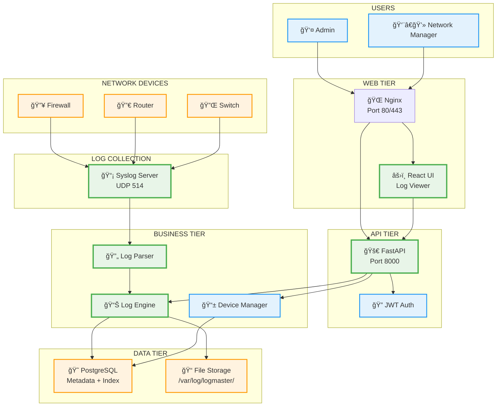

# LogMaster v2 - System Architecture Overview

## 🏗️ Enterprise Architecture

LogMaster v2 is designed as a multi-tier, microservices-based enterprise log management system with granular device-level permissions and full 5651 Turkish Law compliance.

## 📊 System Architecture Diagram

### 🏢 Enterprise-Level Architecture (Full Implementation)



### 🚀 MVP System Architecture (Simplified for Quick Start)



### 📋 Architecture Comparison

| Component | MVP Implementation | Enterprise Implementation |
|-----------|-------------------|---------------------------|
| **Web Layer** | Nginx + React | Nginx + React + Mobile App |
| **Authentication** | Basic JWT | JWT + LDAP + RBAC + 2FA |
| **API Layer** | FastAPI Single Instance | FastAPI + Load Balancer |
| **Data Storage** | PostgreSQL + Files | PostgreSQL + Elasticsearch + Redis |
| **Log Processing** | Synchronous Parser | Async Workers + Queue |
| **Monitoring** | Basic Health Checks | Prometheus + Grafana |
| **Compliance** | File Retention | Digital Signatures + TSA |
| **Deployment** | Single Server | Multi-tier + HA |

## 🔧 Architecture Components

### 👥 User Layer
- **Admin Users**: Full system access and management
- **Network Managers**: Network device management and configuration
- **Security Analysts**: Security log analysis and incident response
- **Location Managers**: Location-specific device and log access
- **Viewers**: Read-only access to authorized logs

### 🌐 Web Layer
- **Nginx Reverse Proxy**: Load balancing, SSL termination, static content
- **React Frontend**: Modern, responsive web interface

### 🚀 API Layer
- **FastAPI Backend**: High-performance async Python API
- **JWT Authentication**: Secure token-based authentication
- **RBAC**: Role-based access control system
- **Device Permissions**: Granular device-level access control

### 🏗️ Business Logic Layer
- **Log Processing Engine**: Real-time log parsing and enrichment
- **Digital Signature Engine**: RSA-256 + TSA compliance
- **5651 Compliance Engine**: Turkish law compliance automation
- **Device Management**: MAC-based device registration and monitoring
- **Audit Trail System**: Comprehensive activity logging

### 🗄️ Data Layer
- **PostgreSQL**: Relational data (users, devices, permissions, metadata)
- **Elasticsearch**: Log search, analytics, and real-time indexing
- **Redis**: Session management, caching, and real-time data

### 📡 Log Collection Layer
- **Syslog Receiver**: UDP port 514 for remote log collection
- **Filebeat Collector**: File-based log collection and forwarding
- **Log Parser & Enricher**: Structured log processing and metadata extraction

### 📊 Monitoring Layer
- **Prometheus**: Metrics collection and alerting
- **Grafana**: Dashboards, visualization, and alert management

### 💾 Storage Layer
- **Log Files**: Raw log storage with device-specific organization
- **Archives**: Compressed and digitally signed historical logs
- **Backups**: Automated backup and disaster recovery

## 🔐 Security Features

### Authentication & Authorization
- JWT-based authentication with refresh tokens
- Multi-factor authentication support
- LDAP/Active Directory integration
- Session management with timeout controls

### Device-Level Security
- MAC address-based device authentication
- Device registration and approval workflow
- Per-device user permission matrix
- Time and IP-based access restrictions

### Data Protection
- Digital signatures for all log files (RSA-256)
- Time stamp authority (TSA) integration
- End-to-end encryption for sensitive data
- Secure key management and rotation

## ⚖️ 5651 Compliance Features

### Legal Requirements
- 2-year minimum log retention
- Digital signature verification
- Complete audit trail maintenance
- Court-ready export formats

### Automated Compliance
- Daily digital signing of log files
- Monthly compliance report generation
- Automated violation detection
- Legal export format generation

## 📈 Scalability & Performance

### Horizontal Scaling
- Microservices architecture with Docker
- Load-balanced web and API tiers
- Elasticsearch cluster for log search
- PostgreSQL read replicas

### Performance Optimization
- Redis caching for frequent queries
- Elasticsearch indexing for fast search
- Asynchronous processing with FastAPI
- Connection pooling and optimization

### High Availability
- Multi-instance deployment
- Database replication
- Automated health checks
- Graceful failover mechanisms

## 🚀 Deployment Architecture

The system supports both single-server and distributed deployments:

- **Development**: Single Docker Compose setup
- **Production**: Multi-tier deployment with load balancing
- **Enterprise**: Clustered deployment with disaster recovery

For detailed deployment information, see [Deployment Guide](../deployment/README.md). 

This comprehensive enterprise architecture ensures LogMaster v2 can handle massive log volumes while maintaining data integrity, security, and compliance with Turkish Law 5651 requirements.

## 🚀 MVP Development Approach

### Core Principle: Log Collection First
LogMaster's primary purpose is **log collection and management** - this must be the foundation of any MVP.

### Phase 1: Core Log Management MVP (1-2 weeks)
**Essential Components:**
```
├── 📡 Syslog Server (Port 514 UDP) ⭐ CORE FEATURE
├── 🔄 Log Parser & Processing Engine
├── 💾 File Storage System (/var/log/logmaster/)
├── 🐘 PostgreSQL (Device metadata + log index)
├── 🚀 FastAPI Backend (Port 8000)
├── ⚛️ Basic React Frontend (Log viewer)
└── 🌐 Nginx Reverse Proxy (Port 80/443)
```

**MVP Data Flow:**
```
Network Devices → UDP 514 → Syslog Receiver → Log Parser → File Storage + DB Index → Web UI
```

**Week 1 Priorities:**
1. **Syslog UDP Receiver** - Accept logs on port 514
2. **Device Identification** - IP/MAC based device mapping
3. **Log Storage** - Daily files per device + metadata index
4. **Basic API** - CRUD operations for logs and devices

**Week 2 Priorities:**
5. **Web Interface** - Log viewing and filtering
6. **Real-time Updates** - WebSocket/SSE for live logs
7. **Device Management** - Add/edit network devices
8. **Basic Search** - Date/device/keyword filtering

### Phase 2: Enhanced Features (2-3 weeks)
```
├── 🔍 Elasticsearch Integration (Advanced search)
├── 👤 User Authentication (JWT)
├── 🛡️ RBAC System (Role-based permissions)
├── 📊 Dashboard & Analytics
├── 🔔 Basic Alerting
└── 📤 Log Export Features
```

### Phase 3: Enterprise & Compliance (3-4 weeks)
```
├── ✍️ Digital Signature Engine (5651 compliance)
├── 📋 Audit Trail System
├── 🔒 Advanced Security Features
├── 📈 Monitoring & Metrics (Prometheus/Grafana)
├── 🗃️ Archive & Retention Management
└── 📊 Compliance Reporting
```

### MVP Technology Stack
```yaml
Core Infrastructure:
  - Language: Python 3.11+
  - Backend: FastAPI + Uvicorn
  - Database: PostgreSQL 15
  - Cache: Redis 7
  - Frontend: React 18 + TypeScript
  - Proxy: Nginx Alpine

Log Collection:
  - Protocol: Syslog (RFC 3164/5424)
  - Transport: UDP Port 514
  - Processing: AsyncIO + Queue
  - Storage: File System + DB Index
  - Format: JSON + Raw text

Development:
  - Containerization: Docker + Docker Compose
  - Version Control: Git + GitHub
  - Documentation: Markdown + Mermaid
  - Testing: pytest + Jest
```

### Success Metrics for MVP
- ✅ **Log Reception**: Successfully receive 1000+ logs/minute
- ✅ **Device Support**: Handle 50+ network devices
- ✅ **Real-time Display**: Show logs with <2 second latency
- ✅ **Search Performance**: Query results in <500ms
- ✅ **Uptime**: 99.9% availability during testing
- ✅ **Storage**: Handle 1GB+ daily log volume

## 🎯 Implementation Priority

**CRITICAL (MVP Core):**
1. Syslog collection (UDP 514)
2. Log parsing and storage
3. Device management
4. Basic web interface

**IMPORTANT (Phase 2):**
5. User authentication
6. Advanced search (Elasticsearch)
7. Role-based access control
8. Dashboard and analytics

**NICE-TO-HAVE (Phase 3):**
9. Digital signatures (5651 compliance)
10. Advanced monitoring
11. Automated archiving
12. Mobile application 