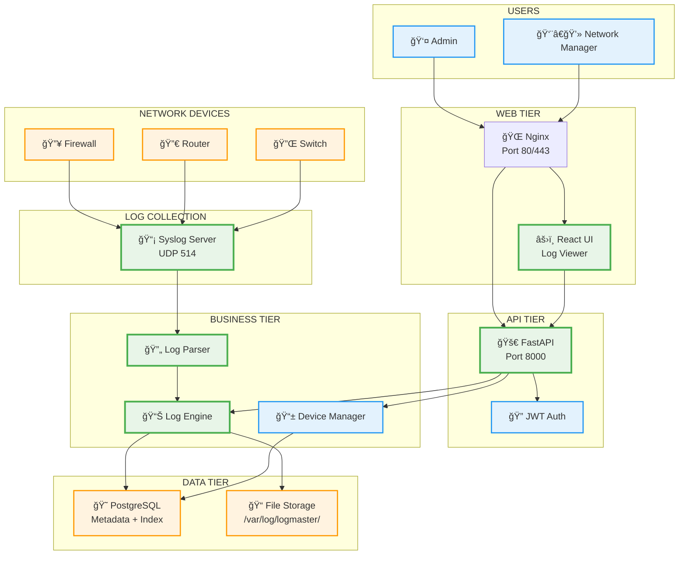

# LogMaster v2 - System Architecture Overview

## 🏗️ Enterprise Architecture

LogMaster v2 is designed as a multi-tier, microservices-based enterprise log management system with granular device-level permissions and full 5651 Turkish Law compliance.

## 📊 System Architecture Diagram

### 🏢 Enterprise-Level Architecture (Full Implementation)



### 🚀 MVP System Architecture (Simplified for Quick Start)



### ⚡ High-Performance Architecture (10,000+ Events/Second)



### 📋 Architecture Comparison

| Component | MVP Implementation | High-Performance Implementation | Enterprise Implementation |
|-----------|-------------------|-------------------------------|---------------------------|
| **Events/Second** | 1,000-2,000 | **10,000+** | 50,000+ |
| **Web Layer** | Single Nginx + React | 3x Load Balanced Web Servers | Global CDN + Multi-region |
| **API Layer** | Single FastAPI Instance | 4x Load Balanced FastAPI | Microservices + Service Mesh |
| **Log Collection** | Single Syslog Server | 3x Load Balanced Syslog | Geographic Distribution |
| **Processing** | Synchronous Parser | 4x Parallel Workers + Queue | ML Pipeline + Stream Processing |
| **Data Storage** | PostgreSQL + Files | Clustered (ES + PG + Redis) | Multi-region + Hot/Cold Tiers |
| **Monitoring** | Basic Health Checks | Real-time Metrics + Auto-scale | AI-based Predictive Analytics |
| **Authentication** | Basic JWT | JWT + Session Management | LDAP + RBAC + 2FA + SSO |
| **Compliance** | File Retention | Basic Digital Signatures | Full 5651 + International Standards |
| **Availability** | 95% (Single Point) | 99.9% (HA Components) | 99.99% (Multi-region DR) |
| **Deployment** | Single Server | Multi-server Cluster | Cloud-native + Kubernetes |
| **Cost (Monthly)** | $500-1,000 | $8,000-12,000 | $25,000+ |

### 🎯 Performance Targets by Architecture Level

#### MVP Targets
- **Events/Second**: 1,000-2,000
- **Response Time**: < 1 second
- **Concurrent Users**: 50
- **Storage**: 100GB/day
- **Uptime**: 95%

#### High-Performance Targets ⭐
- **Events/Second**: **10,000+**
- **Response Time**: < 100ms (P95)
- **Concurrent Users**: 500+
- **Storage**: 1TB/day
- **Uptime**: 99.9%
- **Processing Latency**: < 50ms
- **Queue Depth**: < 10,000
- **Auto-scaling**: Yes

#### Enterprise Targets
- **Events/Second**: 50,000+
- **Response Time**: < 50ms (P95)
- **Concurrent Users**: 2,000+
- **Storage**: 10TB/day
- **Uptime**: 99.99%
- **Multi-region**: Yes
- **Disaster Recovery**: 4-hour RTO

## 🔧 Architecture Components

### 👥 User Layer
- **Admin Users**: Full system access and management
- **Network Managers**: Network device management and configuration
- **Security Analysts**: Security log analysis and incident response
- **Location Managers**: Location-specific device and log access
- **Viewers**: Read-only access to authorized logs

### 🌐 Web Layer
- **Nginx Reverse Proxy**: Load balancing, SSL termination, static content
- **React Frontend**: Modern, responsive web interface

### 🚀 API Layer
- **FastAPI Backend**: High-performance async Python API
- **JWT Authentication**: Secure token-based authentication
- **RBAC**: Role-based access control system
- **Device Permissions**: Granular device-level access control

### 🏗️ Business Logic Layer
- **Log Processing Engine**: Real-time log parsing and enrichment
- **Digital Signature Engine**: RSA-256 + TSA compliance
- **5651 Compliance Engine**: Turkish law compliance automation
- **Device Management**: MAC-based device registration and monitoring
- **Audit Trail System**: Comprehensive activity logging

### 🗄️ Data Layer
- **PostgreSQL**: Relational data (users, devices, permissions, metadata)
- **Elasticsearch**: Log search, analytics, and real-time indexing
- **Redis**: Session management, caching, and real-time data

### 📡 Log Collection Layer
- **Syslog Receiver**: UDP port 514 for remote log collection
- **Filebeat Collector**: File-based log collection and forwarding
- **Log Parser & Enricher**: Structured log processing and metadata extraction

### 📊 Monitoring Layer
- **Prometheus**: Metrics collection and alerting
- **Grafana**: Dashboards, visualization, and alert management

### 💾 Storage Layer
- **Log Files**: Raw log storage with device-specific organization
- **Archives**: Compressed and digitally signed historical logs
- **Backups**: Automated backup and disaster recovery

## 🔐 Security Features

### Authentication & Authorization
- JWT-based authentication with refresh tokens
- Multi-factor authentication support
- LDAP/Active Directory integration
- Session management with timeout controls

### Device-Level Security
- MAC address-based device authentication
- Device registration and approval workflow
- Per-device user permission matrix
- Time and IP-based access restrictions

### Data Protection
- Digital signatures for all log files (RSA-256)
- Time stamp authority (TSA) integration
- End-to-end encryption for sensitive data
- Secure key management and rotation

## ⚖️ 5651 Compliance Features

### Legal Requirements
- 2-year minimum log retention
- Digital signature verification
- Complete audit trail maintenance
- Court-ready export formats

### Automated Compliance
- Daily digital signing of log files
- Monthly compliance report generation
- Automated violation detection
- Legal export format generation

## 📈 Scalability & Performance

### Horizontal Scaling
- Microservices architecture with Docker
- Load-balanced web and API tiers
- Elasticsearch cluster for log search
- PostgreSQL read replicas

### Performance Optimization
- Redis caching for frequent queries
- Elasticsearch indexing for fast search
- Asynchronous processing with FastAPI
- Connection pooling and optimization

### High Availability
- Multi-instance deployment
- Database replication
- Automated health checks
- Graceful failover mechanisms

## 🚀 Deployment Architecture

The system supports both single-server and distributed deployments:

- **Development**: Single Docker Compose setup
- **Production**: Multi-tier deployment with load balancing
- **Enterprise**: Clustered deployment with disaster recovery

For detailed deployment information, see [Deployment Guide](../deployment/README.md). 

This comprehensive enterprise architecture ensures LogMaster v2 can handle massive log volumes while maintaining data integrity, security, and compliance with Turkish Law 5651 requirements.

## 🚀 MVP Development Approach

### Phase 1: Core Log Management MVP (1-2 weeks)
**Essential Components:**
```
├── 📡 Syslog Server (Port 514 UDP) ⭐ CORE FEATURE
├── 🔄 Log Parser & Processing Engine
├── 💾 File Storage System (/var/log/logmaster/)
├── 🐘 PostgreSQL (Device metadata + log index)
├── 🚀 FastAPI Backend (Port 8000)
├── ⚛️ Basic React Frontend (Log viewer)
└── 🌐 Nginx Reverse Proxy (Port 80/443)
```

**MVP Data Flow:**
```
Network Devices → UDP 514 → Syslog Receiver → Log Parser → File Storage + DB Index → Web UI
```

**Week 1 Priorities:**
1. **Syslog UDP Receiver** - Accept logs on port 514
2. **Device Identification** - IP/MAC based device mapping
3. **Log Storage** - Daily files per device + metadata index
4. **Basic API** - CRUD operations for logs and devices

**Week 2 Priorities:**
5. **Web Interface** - Log viewing and filtering
6. **Real-time Updates** - WebSocket/SSE for live logs
7. **Device Management** - Add/edit network devices
8. **Basic Search** - Date/device/keyword filtering

### Phase 2: High-Performance Architecture (10,000+ Events/Second) ⭐
**Duration:** 3-4 weeks
**Target:** Scale to handle enterprise-level log volumes

**Essential Components:**
```
├── ⚖️ Load Balancer Cluster (Web + API + UDP)
├── 🔄 Redis Queue System (Message broker)
├── ⚡ Parallel Processing Workers (4+ AsyncIO workers)
├── 🔍 Elasticsearch Cluster (3 Master + 6 Data nodes)
├── 🐘 PostgreSQL Cluster (1 Master + 2 Read replicas)
├── ⚡ Redis Cluster (6 nodes for caching)
├── 📦 Batch Processing System (1000 events/batch)
├── 📊 Real-time Monitoring (Prometheus + Grafana)
└── 🚨 Auto-scaling System (Performance-based scaling)
```

**High-Performance Data Flow:**
```
Network Device Clusters → UDP Load Balancer → 3x Syslog Receivers → Redis Queue → 
4x Parallel Workers → Batch Writer → Clustered Storage (ES + PG + Redis) → 
Load Balanced APIs → Scaled Web Servers
```

**Week 1-2 Priorities:**
1. **Load Balancer Setup** - UDP, API, and Web load balancing
2. **Redis Queue Implementation** - Message broker for high throughput
3. **Parallel Workers** - Multiple AsyncIO processing workers
4. **Elasticsearch Cluster** - Deploy and configure ES cluster

**Week 3-4 Priorities:**
5. **PostgreSQL Clustering** - Master-slave replication setup
6. **Batch Processing** - Optimize for 1000+ events/batch
7. **Performance Monitoring** - Real-time metrics and dashboards
8. **Auto-scaling Logic** - Automatic horizontal scaling

### Phase 3: Enterprise & Compliance (4-6 weeks)
**Duration:** 4-6 weeks
**Target:** Full enterprise features with legal compliance

**Enterprise Components:**
```
├── ✍️ Digital Signature Engine (5651 compliance)
├── 📋 Audit Trail System
├── 🔒 Advanced Security Features (LDAP + RBAC + 2FA)
├── 📈 Advanced Monitoring & Metrics
├── 🗃️ Archive & Retention Management
├── 📊 Compliance Reporting (Automated legal reports)
├── 🌍 Multi-region Deployment
├── 🏥 Disaster Recovery System
└── 📱 Mobile Application
```

**Week 1-2 Priorities:**
1. **Digital Signature System** - RSA-256 + TSA integration
2. **Advanced Security** - LDAP integration and RBAC
3. **Compliance Engine** - 5651 Turkish Law compliance
4. **Audit System** - Complete activity tracking

**Week 3-4 Priorities:**
5. **Multi-region Setup** - Geographic distribution
6. **Disaster Recovery** - Backup and failover systems
7. **Advanced Analytics** - ML-based anomaly detection
8. **Mobile Application** - iOS/Android app development

### MVP Technology Stack
```yaml
Core Infrastructure:
  - Language: Python 3.11+
  - Backend: FastAPI + Uvicorn
  - Database: PostgreSQL 15
  - Cache: Redis 7
  - Frontend: React 18 + TypeScript
  - Proxy: Nginx Alpine

Log Collection:
  - Protocol: Syslog (RFC 3164/5424)
  - Transport: UDP Port 514
  - Processing: AsyncIO + Queue
  - Storage: File System + DB Index
  - Format: JSON + Raw text

Development:
  - Containerization: Docker + Docker Compose
  - Version Control: Git + GitHub
  - Documentation: Markdown + Mermaid
  - Testing: pytest + Jest
```

### Success Metrics for MVP
- ✅ **Log Reception**: Successfully receive 1000+ logs/minute
- ✅ **Device Support**: Handle 50+ network devices
- ✅ **Real-time Display**: Show logs with <2 second latency
- ✅ **Search Performance**: Query results in <500ms
- ✅ **Uptime**: 99.9% availability during testing
- ✅ **Storage**: Handle 1GB+ daily log volume

### 🎯 Revised Implementation Priority

**CRITICAL (Phase 1 - MVP Core):**
1. Syslog collection (UDP 514)
2. Log parsing and storage
3. Device management
4. Basic web interface
5. PostgreSQL integration
6. Real-time log display

**HIGH PRIORITY (Phase 2 - High Performance):** ⭐
7. **Load balancer implementation**
8. **Redis queue system**
9. **Parallel processing workers**
10. **Elasticsearch clustering**
11. **PostgreSQL clustering**
12. **Performance monitoring**
13. **Auto-scaling system**
14. **Batch processing optimization**

**IMPORTANT (Phase 3 - Enterprise):**
15. Digital signatures (5651 compliance)
16. Advanced security (LDAP + RBAC)
17. Multi-region deployment
18. Disaster recovery
19. Advanced monitoring
20. Compliance reporting
21. Mobile application

### 🏗️ Hardware Requirements by Phase

#### Phase 1 (MVP) - Single Server
```yaml
CPU: 8 cores
RAM: 32GB
Storage: 1TB SSD
Network: 1Gbps
Cost: ~$800/month
```

#### Phase 2 (High-Performance) - Multi-server Cluster ⭐
```yaml
Primary Processing: 64 cores, 256GB RAM, 4x2TB NVMe
Elasticsearch Cluster: 9 nodes (288 cores total)
PostgreSQL Cluster: 3 nodes (80 cores total)
Redis Cluster: 6 nodes (96 cores total)
Network: 25Gbps per server
Cost: ~$10,800/month
```

#### Phase 3 (Enterprise) - Multi-region Infrastructure
```yaml
Multiple Datacenters: 2-3 regions
Disaster Recovery: Hot standby sites
Advanced Monitoring: Dedicated monitoring cluster
Global CDN: Edge caching worldwide
Cost: ~$25,000+/month
``` 