# LogMaster v2 - System Architecture Overview

## 🏗️ Enterprise Architecture

LogMaster v2 is designed as a multi-tier, microservices-based enterprise log management system with granular device-level permissions and full 5651 Turkish Law compliance.

## 📊 System Architecture Diagram

## 🔧 Architecture Components

### 👥 User Layer
- **Admin Users**: Full system access and management
- **Network Managers**: Network device management and configuration
- **Security Analysts**: Security log analysis and incident response
- **Location Managers**: Location-specific device and log access
- **Viewers**: Read-only access to authorized logs

### 🌐 Web Layer
- **Nginx Reverse Proxy**: Load balancing, SSL termination, static content
- **React Frontend**: Modern, responsive web interface

### 🚀 API Layer
- **FastAPI Backend**: High-performance async Python API
- **JWT Authentication**: Secure token-based authentication
- **RBAC**: Role-based access control system
- **Device Permissions**: Granular device-level access control

### 🏗️ Business Logic Layer
- **Log Processing Engine**: Real-time log parsing and enrichment
- **Digital Signature Engine**: RSA-256 + TSA compliance
- **5651 Compliance Engine**: Turkish law compliance automation
- **Device Management**: MAC-based device registration and monitoring
- **Audit Trail System**: Comprehensive activity logging

### 🗄️ Data Layer
- **PostgreSQL**: Relational data (users, devices, permissions, metadata)
- **Elasticsearch**: Log search, analytics, and real-time indexing
- **Redis**: Session management, caching, and real-time data

### 📡 Log Collection Layer
- **Syslog Receiver**: UDP port 514 for remote log collection
- **Filebeat Collector**: File-based log collection and forwarding
- **Log Parser & Enricher**: Structured log processing and metadata extraction

### 📊 Monitoring Layer
- **Prometheus**: Metrics collection and alerting
- **Grafana**: Dashboards, visualization, and alert management

### 💾 Storage Layer
- **Log Files**: Raw log storage with device-specific organization
- **Archives**: Compressed and digitally signed historical logs
- **Backups**: Automated backup and disaster recovery

## 🔐 Security Features

### Authentication & Authorization
- JWT-based authentication with refresh tokens
- Multi-factor authentication support
- LDAP/Active Directory integration
- Session management with timeout controls

### Device-Level Security
- MAC address-based device authentication
- Device registration and approval workflow
- Per-device user permission matrix
- Time and IP-based access restrictions

### Data Protection
- Digital signatures for all log files (RSA-256)
- Time stamp authority (TSA) integration
- End-to-end encryption for sensitive data
- Secure key management and rotation

## ⚖️ 5651 Compliance Features

### Legal Requirements
- 2-year minimum log retention
- Digital signature verification
- Complete audit trail maintenance
- Court-ready export formats

### Automated Compliance
- Daily digital signing of log files
- Monthly compliance report generation
- Automated violation detection
- Legal export format generation

## 📈 Scalability & Performance

### Horizontal Scaling
- Microservices architecture with Docker
- Load-balanced web and API tiers
- Elasticsearch cluster for log search
- PostgreSQL read replicas

### Performance Optimization
- Redis caching for frequent queries
- Elasticsearch indexing for fast search
- Asynchronous processing with FastAPI
- Connection pooling and optimization

### High Availability
- Multi-instance deployment
- Database replication
- Automated health checks
- Graceful failover mechanisms

## 🚀 Deployment Architecture

The system supports both single-server and distributed deployments:

- **Development**: Single Docker Compose setup
- **Production**: Multi-tier deployment with load balancing
- **Enterprise**: Clustered deployment with disaster recovery

For detailed deployment information, see [Deployment Guide](../deployment/README.md). 